# DESIGN PATTERNS - COMPLETE INTERVIEW GUIDE
**C++ Implementation with Theory and Examples**

---

## TABLE OF CONTENTS

### Creational Patterns (Most Asked First)
1. [Singleton Pattern](#1-singleton-pattern-) ⭐⭐⭐
2. [Factory Method Pattern](#2-factory-method-pattern-) ⭐⭐⭐
3. [Abstract Factory Pattern](#3-abstract-factory-pattern-) ⭐⭐
4. [Builder Pattern](#4-builder-pattern-) ⭐⭐
5. [Prototype Pattern](#5-prototype-pattern-) ⭐

### Behavioral Patterns (Most Asked First)
6. [Observer Pattern](#6-observer-pattern-) ⭐⭐⭐
7. [Strategy Pattern](#7-strategy-pattern-) ⭐⭐⭐
8. [Command Pattern](#8-command-pattern-) ⭐⭐
9. [Template Method Pattern](#9-template-method-pattern-) ⭐⭐
10. [State Pattern](#10-state-pattern-) ⭐
11. [Chain of Responsibility Pattern](#11-chain-of-responsibility-pattern-) ⭐

### Structural Patterns (Most Asked First)
12. [Decorator Pattern](#12-decorator-pattern-) ⭐⭐
13. [Adapter Pattern](#13-adapter-pattern-) ⭐⭐
14. [Facade Pattern](#14-facade-pattern-) ⭐
15. [Proxy Pattern](#15-proxy-pattern-) ⭐
16. [Wrapper Pattern](#16-wrapper-pattern-) ⭐

⭐⭐⭐ = Very commonly asked  
⭐⭐ = Commonly asked  
⭐ = Sometimes asked  

---

# CREATIONAL PATTERNS

---

## 1. SINGLETON PATTERN ⭐⭐⭐

### **Problem:**
You need **exactly one instance** of a class throughout the entire application lifecycle.

**Real-world scenarios:**
- Database connection manager (only one connection pool)
- Logger instance (all modules log to same file)
- Configuration manager (one source of truth)
- Thread pool manager
- Cache manager

**Issues without Singleton:**
```cpp
// ❌ PROBLEM: Multiple instances created
Logger logger1;  // In file1.cpp
Logger logger2;  // In file2.cpp
Logger logger3;  // In file3.cpp

// All writing to same log file → corruption, inconsistency!
// Multiple DB connections → resource waste, connection limit exceeded
```

---

### **Solution:**

**Key Concepts:**
1. Private constructor (can't create from outside)
2. Static instance (single shared object)
3. Global access point (static method)
4. Lazy initialization (create when first needed)

---

### **Implementation:**

#### **Basic Singleton (Not Thread-Safe):**

**UML Diagram:**
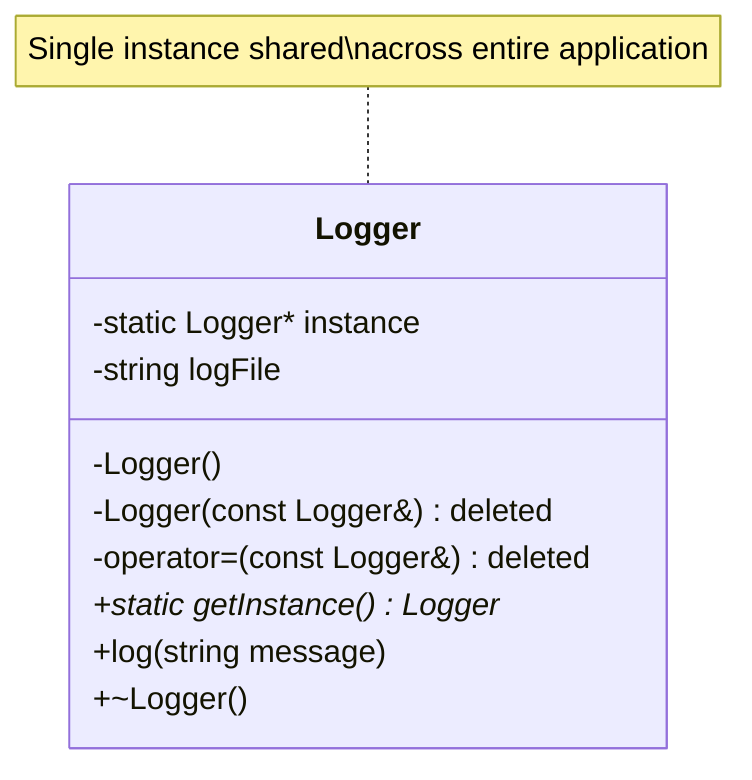
```mermaid
classDiagram
    class Logger {
        -static Logger* instance
        -string logFile
        -Logger()
        -Logger(const Logger&) deleted
        -operator=(const Logger&) deleted
        +static getInstance()* Logger
        +log(string message)
        +~Logger()
    }
    
    note for Logger "Single instance shared\nacross entire application"
```

**Code:**
```cpp
#include <iostream>
#include <string>
using namespace std;

class Logger {
private:
    static Logger* instance;  // Static instance
    string logFile;
    
    // Private constructor
    Logger() {
        logFile = "app.log";
        cout << "Logger instance created\n";
    }
    
    // Delete copy constructor and assignment
    Logger(const Logger&) = delete;
    Logger& operator=(const Logger&) = delete;
    
public:
    // Global access point
    static Logger* getInstance() {
        if (instance == nullptr) {
            instance = new Logger();
        }
        return instance;
    }
    
    void log(const string& message) {
        cout << "[LOG] " << message << " -> " << logFile << "\n";
    }
    
    ~Logger() {
        cout << "Logger destroyed\n";
    }
};

// Initialize static member
Logger* Logger::instance = nullptr;

// Usage
int main() {
    // Get the singleton instance
    Logger* log1 = Logger::getInstance();
    Logger* log2 = Logger::getInstance();
    
    // Both point to same instance
    cout << "log1 address: " << log1 << "\n";
    cout << "log2 address: " << log2 << "\n";
    
    log1->log("First message");
    log2->log("Second message");
    
    // ❌ Cannot create new instances
    // Logger newLog;  // ERROR: constructor is private
    // Logger* copy = new Logger(*log1);  // ERROR: copy constructor deleted
    
    return 0;
}

/* Output:
Logger instance created
log1 address: 0x1234567890
log2 address: 0x1234567890  (SAME address!)
[LOG] First message -> app.log
[LOG] Second message -> app.log
*/
```

---

#### **Thread-Safe Singleton (Meyer's Singleton - C++11):**

**UML Diagram:**
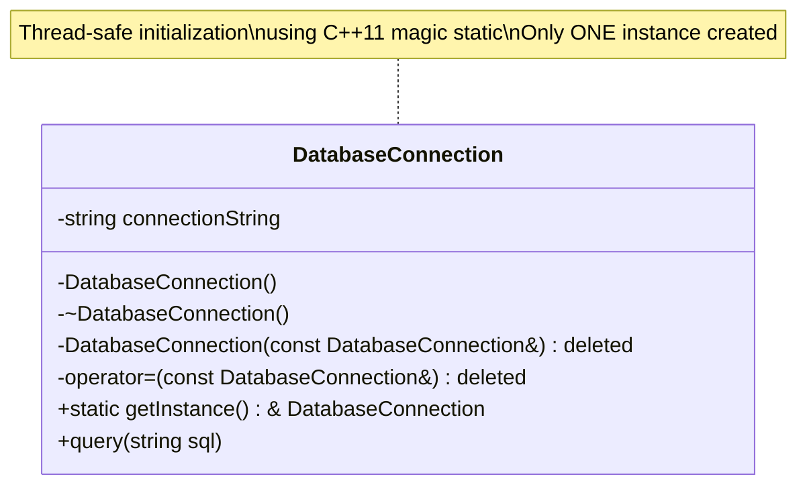
```mermaid
classDiagram
    class DatabaseConnection {
        -string connectionString
        -DatabaseConnection()
        -~DatabaseConnection()
        -DatabaseConnection(const DatabaseConnection&) deleted
        -operator=(const DatabaseConnection&) deleted
        +static getInstance()& DatabaseConnection
        +query(string sql)
    }
    
    note for DatabaseConnection "Thread-safe initialization\nusing C++11 magic static\nOnly ONE instance created"
```

**Code:**
```cpp
#include <iostream>
#include <thread>
#include <vector>
using namespace std;

class DatabaseConnection {
private:
    string connectionString;
    
    DatabaseConnection() {
        connectionString = "Server=localhost;DB=mydb";
        cout << "Database connection established\n";
    }
    
    ~DatabaseConnection() {
        cout << "Database connection closed\n";
    }
    
    // Delete copy and move
    DatabaseConnection(const DatabaseConnection&) = delete;
    DatabaseConnection& operator=(const DatabaseConnection&) = delete;
    DatabaseConnection(DatabaseConnection&&) = delete;
    DatabaseConnection& operator=(DatabaseConnection&&) = delete;
    
public:
    // Thread-safe in C++11+ (magic static)
    static DatabaseConnection& getInstance() {
        static DatabaseConnection instance;  // Created once, thread-safe
        return instance;
    }
    
    void query(const string& sql) {
        cout << "Executing: " << sql << "\n";
    }
};

// Test thread-safety
void workerThread(int id) {
    DatabaseConnection& db = DatabaseConnection::getInstance();
    db.query("SELECT * FROM users WHERE id = " + to_string(id));
}

int main() {
    // Create multiple threads
    vector<thread> threads;
    for (int i = 0; i < 5; ++i) {
        threads.emplace_back(workerThread, i);
    }
    
    for (auto& t : threads) {
        t.join();
    }
    
    // Only ONE database connection created!
    return 0;
}

/* Output:
Database connection established  (Only once!)
Executing: SELECT * FROM users WHERE id = 0
Executing: SELECT * FROM users WHERE id = 1
Executing: SELECT * FROM users WHERE id = 2
Executing: SELECT * FROM users WHERE id = 3
Executing: SELECT * FROM users WHERE id = 4
Database connection closed  (At program end)
*/
```

---

#### **Smart Pointer Singleton (Modern C++):**

```cpp
#include <iostream>
#include <memory>
#include <mutex>
using namespace std;

class ConfigManager {
private:
    static unique_ptr<ConfigManager> instance;
    static mutex mtx;
    
    string appName;
    int maxConnections;
    
    ConfigManager() {
        appName = "MyApp";
        maxConnections = 100;
        cout << "Config loaded\n";
    }
    
public:
    ConfigManager(const ConfigManager&) = delete;
    ConfigManager& operator=(const ConfigManager&) = delete;
    
    static ConfigManager* getInstance() {
        if (!instance) {
            lock_guard<mutex> lock(mtx);
            if (!instance) {  // Double-check locking
                instance.reset(new ConfigManager());
            }
        }
        return instance.get();
    }
    
    string getAppName() const { return appName; }
    int getMaxConnections() const { return maxConnections; }
};

// Initialize static members
unique_ptr<ConfigManager> ConfigManager::instance = nullptr;
mutex ConfigManager::mtx;

int main() {
    ConfigManager* config = ConfigManager::getInstance();
    cout << "App: " << config->getAppName() << "\n";
    cout << "Max Connections: " << config->getMaxConnections() << "\n";
    
    // No manual cleanup needed - unique_ptr handles it!
    return 0;
}
```

---

### **Advantages:**
✅ Controlled access to single instance  
✅ Reduced global namespace pollution  
✅ Lazy initialization (created when needed)  
✅ Easy to extend (can allow multiple instances later)  

### **Disadvantages:**
❌ Global state (can make testing difficult)  
❌ Violates Single Responsibility Principle  
❌ Difficult to unit test (hidden dependencies)  
❌ Can create tight coupling  

### **When to Use:**
- Logging systems
- Configuration managers
- Database connection pools
- Cache managers
- Thread pools
- Device drivers

### **Interview Tips:**
- **Know thread-safety implementations**
- Explain Meyer's Singleton (C++11 magic static)
- Discuss lazy vs eager initialization
- Be ready to critique: "Singleton is anti-pattern debate"
- Show how to mock in tests (dependency injection)

---

## 2. FACTORY METHOD PATTERN ⭐⭐⭐

### **Problem:**
You need to create objects **without specifying their exact class**. The exact type of object is determined at runtime.

**Real-world scenarios:**
- Creating different types of documents (PDF, Word, Excel)
- Different payment processors (PayPal, Stripe, Cash)
- Different notification channels (Email, SMS, Push)
- Different database connections (MySQL, PostgreSQL, MongoDB)

**Issues without Factory:**
```cpp
// ❌ PROBLEM: Client code tightly coupled to concrete classes
void processPayment(string type) {
    if (type == "paypal") {
        PayPalPayment* payment = new PayPalPayment();
        payment->process();
    } else if (type == "stripe") {
        StripePayment* payment = new StripePayment();
        payment->process();
    } else if (type == "cash") {
        CashPayment* payment = new CashPayment();
        payment->process();
    }
    // Adding new payment type = modify this function!
    // Violates Open-Closed Principle
}
```

---

### **Solution:**

**Key Concepts:**
1. Define interface/base class for products
2. Factory method creates instances
3. Client code uses interface, not concrete classes
4. Easy to add new types without changing existing code

---

### **Implementation:**

#### **Simple Factory (Not Gang of Four):**

**UML Diagram:**
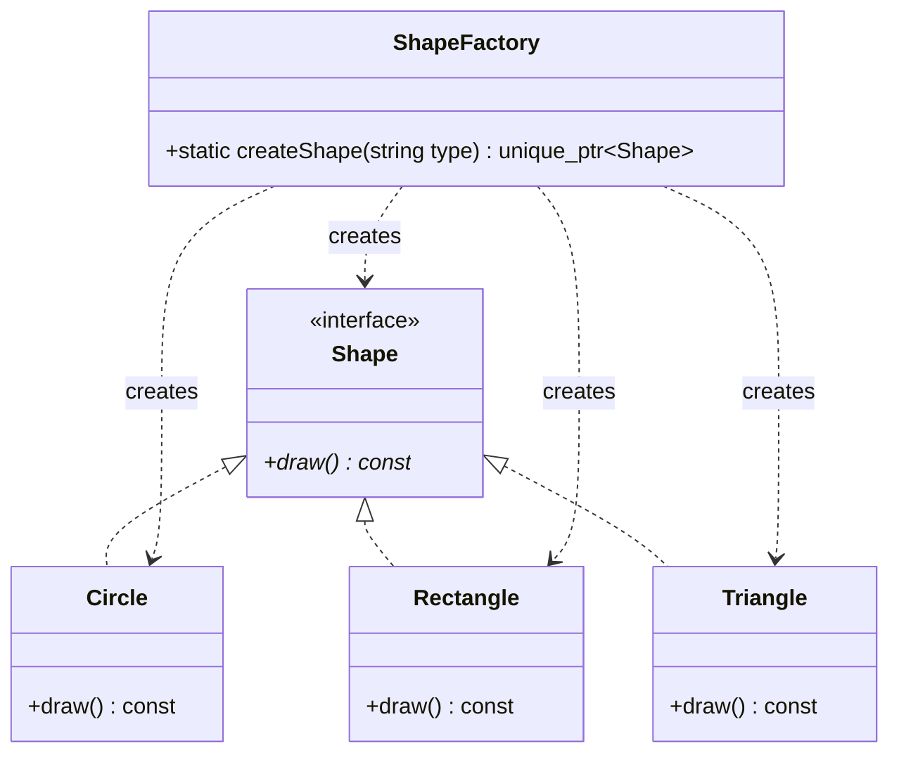
```mermaid
classDiagram
    class Shape {
        <<interface>>
        +draw() const*
    }
    
    class Circle {
        +draw() const
    }
    
    class Rectangle {
        +draw() const
    }
    
    class Triangle {
        +draw() const
    }
    
    class ShapeFactory {
        +static createShape(string type) unique_ptr~Shape~
    }
    
    Shape <|.. Circle
    Shape <|.. Rectangle
    Shape <|.. Triangle
    ShapeFactory ..> Shape : creates
    ShapeFactory ..> Circle : creates
    ShapeFactory ..> Rectangle : creates
    ShapeFactory ..> Triangle : creates
```

**Code:**
```cpp
#include <iostream>
#include <memory>
using namespace std;

// Product interface
class Shape {
public:
    virtual void draw() const = 0;
    virtual ~Shape() = default;
};

// Concrete products
class Circle : public Shape {
public:
    void draw() const override {
        cout << "Drawing Circle\n";
    }
};

class Rectangle : public Shape {
public:
    void draw() const override {
        cout << "Drawing Rectangle\n";
    }
};

class Triangle : public Shape {
public:
    void draw() const override {
        cout << "Drawing Triangle\n";
    }
};

// Factory class
class ShapeFactory {
public:
    static unique_ptr<Shape> createShape(const string& type) {
        if (type == "circle") {
            return make_unique<Circle>();
        } else if (type == "rectangle") {
            return make_unique<Rectangle>();
        } else if (type == "triangle") {
            return make_unique<Triangle>();
        }
        return nullptr;
    }
};

// Usage
int main() {
    // Client code doesn't know about concrete classes!
    auto shape1 = ShapeFactory::createShape("circle");
    auto shape2 = ShapeFactory::createShape("rectangle");
    auto shape3 = ShapeFactory::createShape("triangle");
    
    if (shape1) shape1->draw();
    if (shape2) shape2->draw();
    if (shape3) shape3->draw();
    
    // Easy to add new shapes without changing client code
    return 0;
}

/* Output:
Drawing Circle
Drawing Rectangle
Drawing Triangle
*/
```

---

#### **Factory Method Pattern (GoF):**

**UML Diagram:**
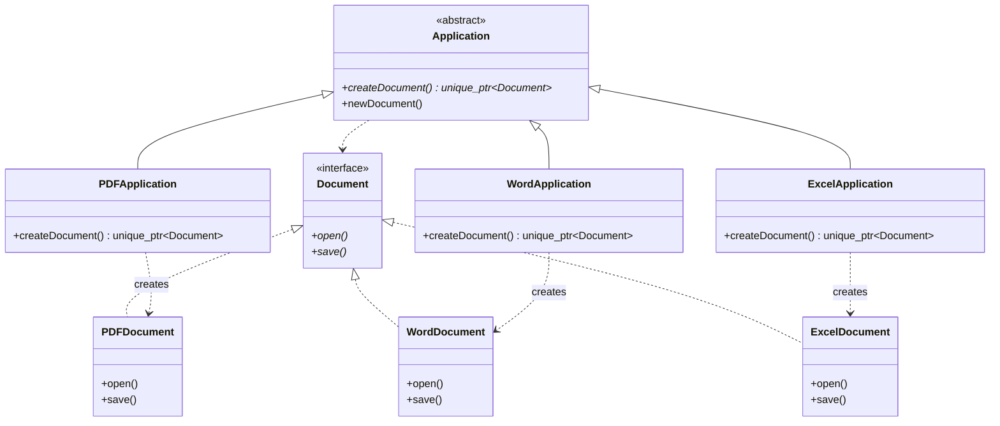
```mermaid
classDiagram
    class Document {
        <<interface>>
        +open()*
        +save()*
    }
    
    class PDFDocument {
        +open()
        +save()
    }
    
    class WordDocument {
        +open()
        +save()
    }
    
    class ExcelDocument {
        +open()
        +save()
    }
    
    class Application {
        <<abstract>>
        +createDocument()* unique_ptr~Document~
        +newDocument()
    }
    
    class PDFApplication {
        +createDocument() unique_ptr~Document~
    }
    
    class WordApplication {
        +createDocument() unique_ptr~Document~
    }
    
    class ExcelApplication {
        +createDocument() unique_ptr~Document~
    }
    
    Document <|.. PDFDocument
    Document <|.. WordDocument
    Document <|.. ExcelDocument
    Application <|-- PDFApplication
    Application <|-- WordApplication
    Application <|-- ExcelApplication
    Application ..> Document
    PDFApplication ..> PDFDocument : creates
    WordApplication ..> WordDocument : creates
    ExcelApplication ..> ExcelDocument : creates
```

**Code:**
```cpp
#include <iostream>
#include <memory>
#include <vector>
using namespace std;

// Product interface
class Document {
public:
    virtual void open() = 0;
    virtual void save() = 0;
    virtual ~Document() = default;
};

// Concrete products
class PDFDocument : public Document {
public:
    void open() override {
        cout << "Opening PDF document\n";
    }
    void save() override {
        cout << "Saving PDF document\n";
    }
};

class WordDocument : public Document {
public:
    void open() override {
        cout << "Opening Word document\n";
    }
    void save() override {
        cout << "Saving Word document\n";
    }
};

class ExcelDocument : public Document {
public:
    void open() override {
        cout << "Opening Excel spreadsheet\n";
    }
    void save() override {
        cout << "Saving Excel spreadsheet\n";
    }
};

// Creator (abstract factory)
class Application {
public:
    // Factory method - to be overridden
    virtual unique_ptr<Document> createDocument() = 0;
    
    void newDocument() {
        auto doc = createDocument();  // Use factory method
        doc->open();
        cout << "Working on document...\n";
        doc->save();
    }
    
    virtual ~Application() = default;
};

// Concrete creators
class PDFApplication : public Application {
public:
    unique_ptr<Document> createDocument() override {
        return make_unique<PDFDocument>();
    }
};

class WordApplication : public Application {
public:
    unique_ptr<Document> createDocument() override {
        return make_unique<WordDocument>();
    }
};

class ExcelApplication : public Application {
public:
    unique_ptr<Document> createDocument() override {
        return make_unique<ExcelDocument>();
    }
};

// Usage
int main() {
    vector<unique_ptr<Application>> apps;
    
    apps.push_back(make_unique<PDFApplication>());
    apps.push_back(make_unique<WordApplication>());
    apps.push_back(make_unique<ExcelApplication>());
    
    for (auto& app : apps) {
        app->newDocument();
        cout << "---\n";
    }
    
    return 0;
}

/* Output:
Opening PDF document
Working on document...
Saving PDF document
---
Opening Word document
Working on document...
Saving Word document
---
Opening Excel spreadsheet
Working on document...
Saving Excel spreadsheet
---
*/
```

---

#### **Real-World Example: Payment Processing:**

**UML Diagram:**
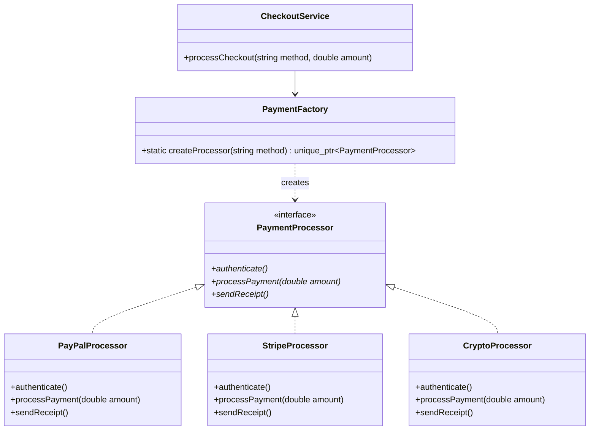
```mermaid
classDiagram
    class PaymentProcessor {
        <<interface>>
        +authenticate()*
        +processPayment(double amount)*
        +sendReceipt()*
    }
    
    class PayPalProcessor {
        +authenticate()
        +processPayment(double amount)
        +sendReceipt()
    }
    
    class StripeProcessor {
        +authenticate()
        +processPayment(double amount)
        +sendReceipt()
    }
    
    class CryptoProcessor {
        +authenticate()
        +processPayment(double amount)
        +sendReceipt()
    }
    
    class PaymentFactory {
        +static createProcessor(string method) unique_ptr~PaymentProcessor~
    }
    
    class CheckoutService {
        +processCheckout(string method, double amount)
    }
    
    PaymentProcessor <|.. PayPalProcessor
    PaymentProcessor <|.. StripeProcessor
    PaymentProcessor <|.. CryptoProcessor
    PaymentFactory ..> PaymentProcessor : creates
    CheckoutService --> PaymentFactory
```

**Code:**
```cpp
#include <iostream>
#include <memory>
using namespace std;

// Product interface
class PaymentProcessor {
public:
    virtual void authenticate() = 0;
    virtual void processPayment(double amount) = 0;
    virtual void sendReceipt() = 0;
    virtual ~PaymentProcessor() = default;
};

// Concrete products
class PayPalProcessor : public PaymentProcessor {
public:
    void authenticate() override {
        cout << "PayPal: Authenticating with OAuth\n";
    }
    void processPayment(double amount) override {
        cout << "PayPal: Processing $" << amount << "\n";
    }
    void sendReceipt() override {
        cout << "PayPal: Sending email receipt\n";
    }
};

class StripeProcessor : public PaymentProcessor {
public:
    void authenticate() override {
        cout << "Stripe: Validating API key\n";
    }
    void processPayment(double amount) override {
        cout << "Stripe: Charging $" << amount << "\n";
    }
    void sendReceipt() override {
        cout << "Stripe: Generating receipt PDF\n";
    }
};

class CryptoProcessor : public PaymentProcessor {
public:
    void authenticate() override {
        cout << "Crypto: Connecting to blockchain wallet\n";
    }
    void processPayment(double amount) override {
        cout << "Crypto: Transferring " << amount << " BTC\n";
    }
    void sendReceipt() override {
        cout << "Crypto: Recording transaction on blockchain\n";
    }
};

// Factory
class PaymentFactory {
public:
    static unique_ptr<PaymentProcessor> createProcessor(const string& method) {
        if (method == "paypal") {
            return make_unique<PayPalProcessor>();
        } else if (method == "stripe") {
            return make_unique<StripeProcessor>();
        } else if (method == "crypto") {
            return make_unique<CryptoProcessor>();
        }
        return nullptr;
    }
};

// Client code
class CheckoutService {
public:
    void processCheckout(const string& paymentMethod, double amount) {
        auto processor = PaymentFactory::createProcessor(paymentMethod);
        
        if (processor) {
            processor->authenticate();
            processor->processPayment(amount);
            processor->sendReceipt();
        } else {
            cout << "Unknown payment method\n";
        }
    }
};

int main() {
    CheckoutService checkout;
    
    cout << "=== Order 1 ===" << "\n";
    checkout.processCheckout("paypal", 99.99);
    
    cout << "\n=== Order 2 ===" << "\n";
    checkout.processCheckout("stripe", 149.50);
    
    cout << "\n=== Order 3 ===" << "\n";
    checkout.processCheckout("crypto", 0.005);
    
    return 0;
}
```

---

### **Advantages:**
✅ Loose coupling (client doesn't know concrete classes)  
✅ Open-Closed Principle (add new types easily)  
✅ Single Responsibility (creation logic separated)  
✅ Code reusability  

### **Disadvantages:**
❌ Can become complex with many product types  
❌ Factory class grows as products increase  

### **When to Use:**
- Object type determined at runtime
- Multiple similar classes with common interface
- Need to decouple object creation from usage
- Extensibility is important

### **Interview Tips:**
- Explain difference between **Simple Factory** and **Factory Method**
- Show how it follows **Open-Closed Principle**
- Discuss when **NOT** to use it (overkill for 2-3 types)
- Be ready to combine with Singleton (Factory as singleton)

---

## 3. ABSTRACT FACTORY PATTERN ⭐⭐

### **Problem:**
You need to create **families of related objects** without specifying their concrete classes. Different families should work together.

**Real-world scenarios:**
- Cross-platform UI (Windows buttons/scrollbars vs Mac buttons/scrollbars)
- Different database vendors (MySQL, PostgreSQL) with Connection, Command, DataReader
- Theme systems (Dark theme vs Light theme) with colors, fonts, icons
- Different document formats with Headers, Footers, Paragraphs

**Issues without Abstract Factory:**
```cpp
// ❌ PROBLEM: Mixing incompatible components
WindowsButton* button = new WindowsButton();
MacScrollbar* scrollbar = new MacScrollbar();  // Mixing Windows and Mac!
// UI looks inconsistent, may not work together
```

---

### **Solution:**

**Key Concepts:**
1. Abstract factory interface declares creation methods
2. Concrete factories create families of related objects
3. Products within a family are designed to work together
4. Client uses only abstract interfaces

---

### **Implementation:**

#### **UI Component Example:**

**UML Diagram:**
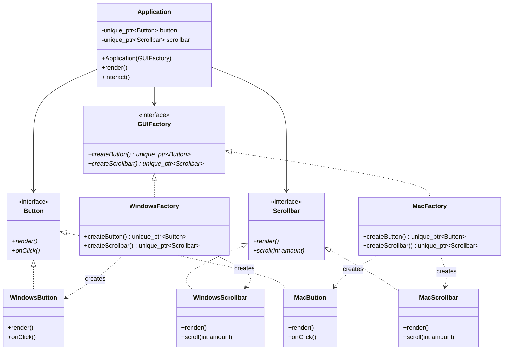
```mermaid
classDiagram
    class Button {
        <<interface>>
        +render()*
        +onClick()*
    }
    
    class Scrollbar {
        <<interface>>
        +render()*
        +scroll(int amount)*
    }
    
    class WindowsButton {
        +render()
        +onClick()
    }
    
    class WindowsScrollbar {
        +render()
        +scroll(int amount)
    }
    
    class MacButton {
        +render()
        +onClick()
    }
    
    class MacScrollbar {
        +render()
        +scroll(int amount)
    }
    
    class GUIFactory {
        <<interface>>
        +createButton()* unique_ptr~Button~
        +createScrollbar()* unique_ptr~Scrollbar~
    }
    
    class WindowsFactory {
        +createButton() unique_ptr~Button~
        +createScrollbar() unique_ptr~Scrollbar~
    }
    
    class MacFactory {
        +createButton() unique_ptr~Button~
        +createScrollbar() unique_ptr~Scrollbar~
    }
    
    class Application {
        -unique_ptr~Button~ button
        -unique_ptr~Scrollbar~ scrollbar
        +Application(GUIFactory)
        +render()
        +interact()
    }
    
    Button <|.. WindowsButton
    Button <|.. MacButton
    Scrollbar <|.. WindowsScrollbar
    Scrollbar <|.. MacScrollbar
    GUIFactory <|.. WindowsFactory
    GUIFactory <|.. MacFactory
    WindowsFactory ..> WindowsButton : creates
    WindowsFactory ..> WindowsScrollbar : creates
    MacFactory ..> MacButton : creates
    MacFactory ..> MacScrollbar : creates
    Application --> GUIFactory
    Application --> Button
    Application --> Scrollbar
```

**Code:**
```cpp
#include <iostream>
#include <memory>
using namespace std;

// Abstract products
class Button {
public:
    virtual void render() = 0;
    virtual void onClick() = 0;
    virtual ~Button() = default;
};

class Scrollbar {
public:
    virtual void render() = 0;
    virtual void scroll(int amount) = 0;
    virtual ~Scrollbar() = default;
};

// Windows family
class WindowsButton : public Button {
public:
    void render() override {
        cout << "Rendering Windows-style button\n";
    }
    void onClick() override {
        cout << "Windows button clicked (Win10 animation)\n";
    }
};

class WindowsScrollbar : public Scrollbar {
public:
    void render() override {
        cout << "Rendering Windows-style scrollbar\n";
    }
    void scroll(int amount) override {
        cout << "Windows scrollbar: Smooth scroll " << amount << " pixels\n";
    }
};

// Mac family
class MacButton : public Button {
public:
    void render() override {
        cout << "Rendering Mac-style button\n";
    }
    void onClick() override {
        cout << "Mac button clicked (macOS animation)\n";
    }
};

class MacScrollbar : public Scrollbar {
public:
    void render() override {
        cout << "Rendering Mac-style scrollbar\n";
    }
    void scroll(int amount) override {
        cout << "Mac scrollbar: Elastic scroll " << amount << " pixels\n";
    }
};

// Abstract Factory
class GUIFactory {
public:
    virtual unique_ptr<Button> createButton() = 0;
    virtual unique_ptr<Scrollbar> createScrollbar() = 0;
    virtual ~GUIFactory() = default;
};

// Concrete factories
class WindowsFactory : public GUIFactory {
public:
    unique_ptr<Button> createButton() override {
        return make_unique<WindowsButton>();
    }
    unique_ptr<Scrollbar> createScrollbar() override {
        return make_unique<WindowsScrollbar>();
    }
};

class MacFactory : public GUIFactory {
public:
    unique_ptr<Button> createButton() override {
        return make_unique<MacButton>();
    }
    unique_ptr<Scrollbar> createScrollbar() override {
        return make_unique<MacScrollbar>();
    }
};

// Client code
class Application {
    unique_ptr<Button> button;
    unique_ptr<Scrollbar> scrollbar;
    
public:
    Application(GUIFactory& factory) {
        button = factory.createButton();
        scrollbar = factory.createScrollbar();
    }
    
    void render() {
        button->render();
        scrollbar->render();
    }
    
    void interact() {
        button->onClick();
        scrollbar->scroll(100);
    }
};

int main() {
    // Detect OS at runtime
    string os = "Windows";  // Could be from environment variable
    
    unique_ptr<GUIFactory> factory;
    
    if (os == "Windows") {
        factory = make_unique<WindowsFactory>();
    } else {
        factory = make_unique<MacFactory>();
    }
    
    Application app(*factory);
    app.render();
    app.interact();
    
    // All components are from same family - consistent UI!
    return 0;
}
```

---

#### **Database Example:**

**UML Diagram:**
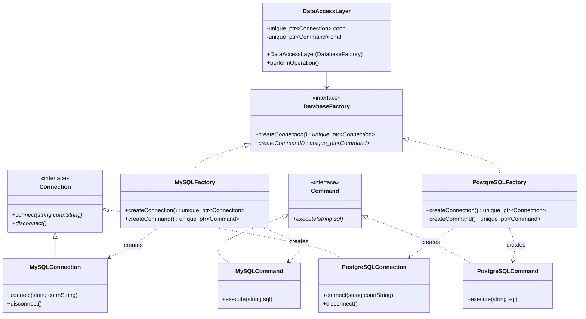
```mermaid
classDiagram
    class Connection {
        <<interface>>
        +connect(string connString)*
        +disconnect()*
    }
    
    class Command {
        <<interface>>
        +execute(string sql)*
    }
    
    class MySQLConnection {
        +connect(string connString)
        +disconnect()
    }
    
    class MySQLCommand {
        +execute(string sql)
    }
    
    class PostgreSQLConnection {
        +connect(string connString)
        +disconnect()
    }
    
    class PostgreSQLCommand {
        +execute(string sql)
    }
    
    class DatabaseFactory {
        <<interface>>
        +createConnection()* unique_ptr~Connection~
        +createCommand()* unique_ptr~Command~
    }
    
    class MySQLFactory {
        +createConnection() unique_ptr~Connection~
        +createCommand() unique_ptr~Command~
    }
    
    class PostgreSQLFactory {
        +createConnection() unique_ptr~Connection~
        +createCommand() unique_ptr~Command~
    }
    
    class DataAccessLayer {
        -unique_ptr~Connection~ conn
        -unique_ptr~Command~ cmd
        +DataAccessLayer(DatabaseFactory)
        +performOperation()
    }
    
    Connection <|.. MySQLConnection
    Connection <|.. PostgreSQLConnection
    Command <|.. MySQLCommand
    Command <|.. PostgreSQLCommand
    DatabaseFactory <|.. MySQLFactory
    DatabaseFactory <|.. PostgreSQLFactory
    MySQLFactory ..> MySQLConnection : creates
    MySQLFactory ..> MySQLCommand : creates
    PostgreSQLFactory ..> PostgreSQLConnection : creates
    PostgreSQLFactory ..> PostgreSQLCommand : creates
    DataAccessLayer --> DatabaseFactory
```

**Code:**
```cpp
#include <iostream>
#include <memory>
using namespace std;

// Abstract products
class Connection {
public:
    virtual void connect(const string& connString) = 0;
    virtual void disconnect() = 0;
    virtual ~Connection() = default;
};

class Command {
public:
    virtual void execute(const string& sql) = 0;
    virtual ~Command() = default;
};

// MySQL family
class MySQLConnection : public Connection {
public:
    void connect(const string& connString) override {
        cout << "MySQL: Connecting to " << connString << "\n";
    }
    void disconnect() override {
        cout << "MySQL: Disconnecting\n";
    }
};

class MySQLCommand : public Command {
public:
    void execute(const string& sql) override {
        cout << "MySQL: Executing - " << sql << "\n";
    }
};

// PostgreSQL family
class PostgreSQLConnection : public Connection {
public:
    void connect(const string& connString) override {
        cout << "PostgreSQL: Connecting to " << connString << "\n";
    }
    void disconnect() override {
        cout << "PostgreSQL: Disconnecting\n";
    }
};

class PostgreSQLCommand : public Command {
public:
    void execute(const string& sql) override {
        cout << "PostgreSQL: Executing - " << sql << "\n";
    }
};

// Abstract Factory
class DatabaseFactory {
public:
    virtual unique_ptr<Connection> createConnection() = 0;
    virtual unique_ptr<Command> createCommand() = 0;
    virtual ~DatabaseFactory() = default;
};

// Concrete factories
class MySQLFactory : public DatabaseFactory {
public:
    unique_ptr<Connection> createConnection() override {
        return make_unique<MySQLConnection>();
    }
    unique_ptr<Command> createCommand() override {
        return make_unique<MySQLCommand>();
    }
};

class PostgreSQLFactory : public DatabaseFactory {
public:
    unique_ptr<Connection> createConnection() override {
        return make_unique<PostgreSQLConnection>();
    }
    unique_ptr<Command> createCommand() override {
        return make_unique<PostgreSQLCommand>();
    }
};

// Client
class DataAccessLayer {
    unique_ptr<Connection> conn;
    unique_ptr<Command> cmd;
    
public:
    DataAccessLayer(DatabaseFactory& factory) {
        conn = factory.createConnection();
        cmd = factory.createCommand();
    }
    
    void performOperation() {
        conn->connect("server=localhost;db=mydb");
        cmd->execute("SELECT * FROM users");
        conn->disconnect();
    }
};

int main() {
    // Configuration determines database type
    string dbType = "PostgreSQL";  // From config file
    
    unique_ptr<DatabaseFactory> factory;
    
    if (dbType == "MySQL") {
        factory = make_unique<MySQLFactory>();
    } else if (dbType == "PostgreSQL") {
        factory = make_unique<PostgreSQLFactory>();
    }
    
    DataAccessLayer dal(*factory);
    dal.performOperation();
    
    // All database components compatible!
    return 0;
}
```

---

### **Advantages:**
✅ Ensures compatibility between related objects  
✅ Isolates concrete classes  
✅ Easy to swap entire product families  
✅ Consistency across products  

### **Disadvantages:**
❌ Complex to implement  
❌ Adding new products requires changing all factories  

### **When to Use:**
- System needs to work with multiple families of products
- Products must be used together (consistency important)
- Want to provide product library, hide implementations
- Cross-platform applications

### **Interview Tips:**
- Explain difference from **Factory Method** (family vs single product)
- Show how it ensures **product consistency**
- Discuss scalability challenges
- Be ready to draw UML diagram

---

## 4. BUILDER PATTERN ⭐⭐

### **Problem:**
You need to construct **complex objects step-by-step**. Objects have many optional parameters, and you want to avoid **telescoping constructors**.

**Real-world scenarios:**
- Building complex queries (SQL, MongoDB)
- Creating HTTP requests with many optional headers
- Building complex UI dialogs
- Constructing meal orders (burger with custom toppings)
- Creating complex documents

**Issues without Builder:**
```cpp
// ❌ PROBLEM: Telescoping constructors - nightmare!
class Pizza {
public:
    Pizza(int size) { }
    Pizza(int size, bool cheese) { }
    Pizza(int size, bool cheese, bool pepperoni) { }
    Pizza(int size, bool cheese, bool pepperoni, bool mushrooms) { }
    Pizza(int size, bool cheese, bool pepperoni, bool mushrooms, 
          bool olives, bool bacon, bool onions) { }
    // 20 more overloads...
};

// Usage - confusing!
Pizza p(12, true, false, true, false, true, false);
// What does this mean? Which toppings are true/false?
```

---

### **Solution:**

**Key Concepts:**
1. Separate construction from representation
2. Build object step-by-step
3. Same construction process creates different representations
4. Fluent interface (method chaining)

---

### **Implementation:**

#### **Basic Builder Pattern:**

**UML Diagram:**
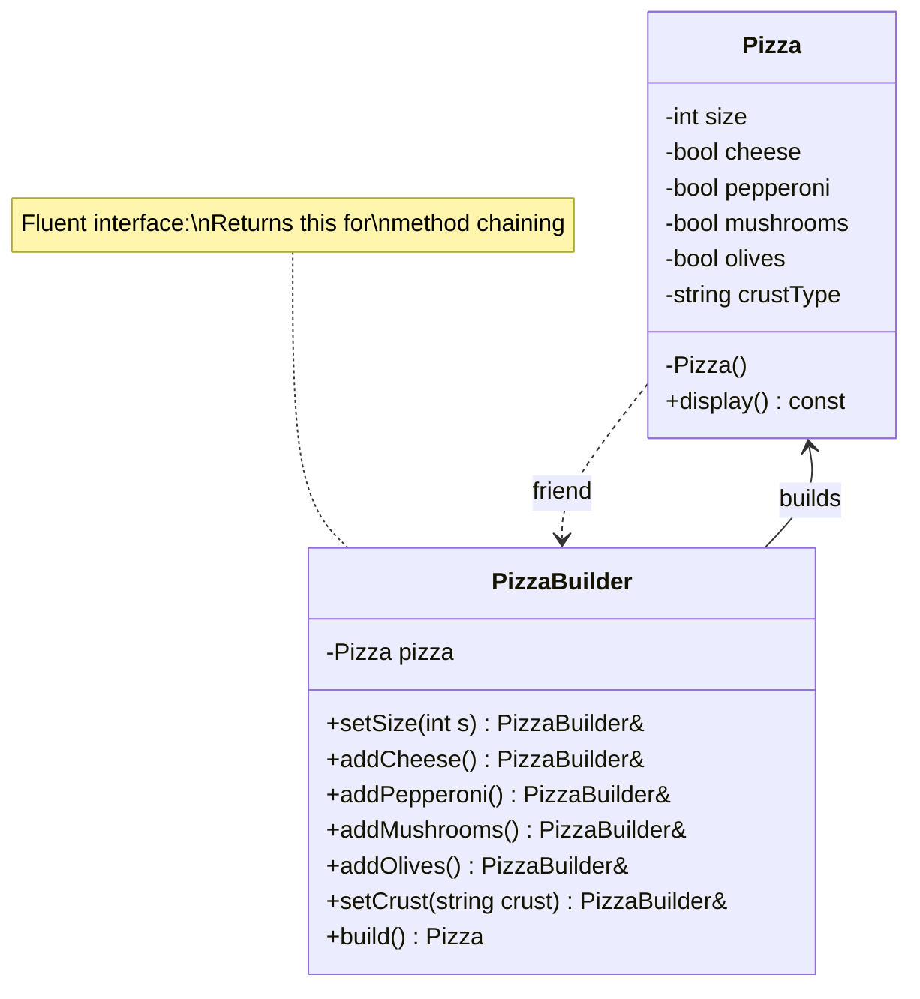
```mermaid
classDiagram
    class Pizza {
        -int size
        -bool cheese
        -bool pepperoni
        -bool mushrooms
        -bool olives
        -string crustType
        -Pizza()
        +display() const
    }
    
    class PizzaBuilder {
        -Pizza pizza
        +setSize(int s) PizzaBuilder&
        +addCheese() PizzaBuilder&
        +addPepperoni() PizzaBuilder&
        +addMushrooms() PizzaBuilder&
        +addOlives() PizzaBuilder&
        +setCrust(string crust) PizzaBuilder&
        +build() Pizza
    }
    
    PizzaBuilder --> Pizza : builds
    Pizza ..> PizzaBuilder : friend
    
    note for PizzaBuilder "Fluent interface:\nReturns this for\nmethod chaining"
```

**Code:**
```cpp
#include <iostream>
#include <string>
#include <vector>
using namespace std;

// Product
class Pizza {
private:
    int size;
    bool cheese;
    bool pepperoni;
    bool mushrooms;
    bool olives;
    string crustType;
    
    // Private constructor - only builder can create
    Pizza() : size(0), cheese(false), pepperoni(false), 
              mushrooms(false), olives(false), crustType("regular") {}
    
public:
    friend class PizzaBuilder;  // Builder can access private members
    
    void display() const {
        cout << "\n=== Pizza Order ===\n";
        cout << "Size: " << size << " inches\n";
        cout << "Crust: " << crustType << "\n";
        cout << "Toppings: ";
        if (cheese) cout << "Cheese ";
        if (pepperoni) cout << "Pepperoni ";
        if (mushrooms) cout << "Mushrooms ";
        if (olives) cout << "Olives ";
        cout << "\n===================\n";
    }
};

// Builder
class PizzaBuilder {
private:
    Pizza pizza;
    
public:
    PizzaBuilder& setSize(int s) {
        pizza.size = s;
        return *this;  // Return reference for chaining
    }
    
    PizzaBuilder& addCheese() {
        pizza.cheese = true;
        return *this;
    }
    
    PizzaBuilder& addPepperoni() {
        pizza.pepperoni = true;
        return *this;
    }
    
    PizzaBuilder& addMushrooms() {
        pizza.mushrooms = true;
        return *this;
    }
    
    PizzaBuilder& addOlives() {
        pizza.olives = true;
        return *this;
    }
    
    PizzaBuilder& setCrust(const string& crust) {
        pizza.crustType = crust;
        return *this;
    }
    
    Pizza build() {
        return pizza;
    }
};

int main() {
    // Build pizzas with readable, clear syntax
    Pizza margherita = PizzaBuilder()
        .setSize(12)
        .setCrust("thin")
        .addCheese()
        .build();
    
    Pizza supreme = PizzaBuilder()
        .setSize(16)
        .setCrust("thick")
        .addCheese()
        .addPepperoni()
        .addMushrooms()
        .addOlives()
        .build();
    
    Pizza simple = PizzaBuilder()
        .setSize(10)
        .addPepperoni()
        .build();
    
    margherita.display();
    supreme.display();
    simple.display();
    
    return 0;
}
```

---

#### **Real-World Example: HTTP Request Builder:**

**UML Diagram:**
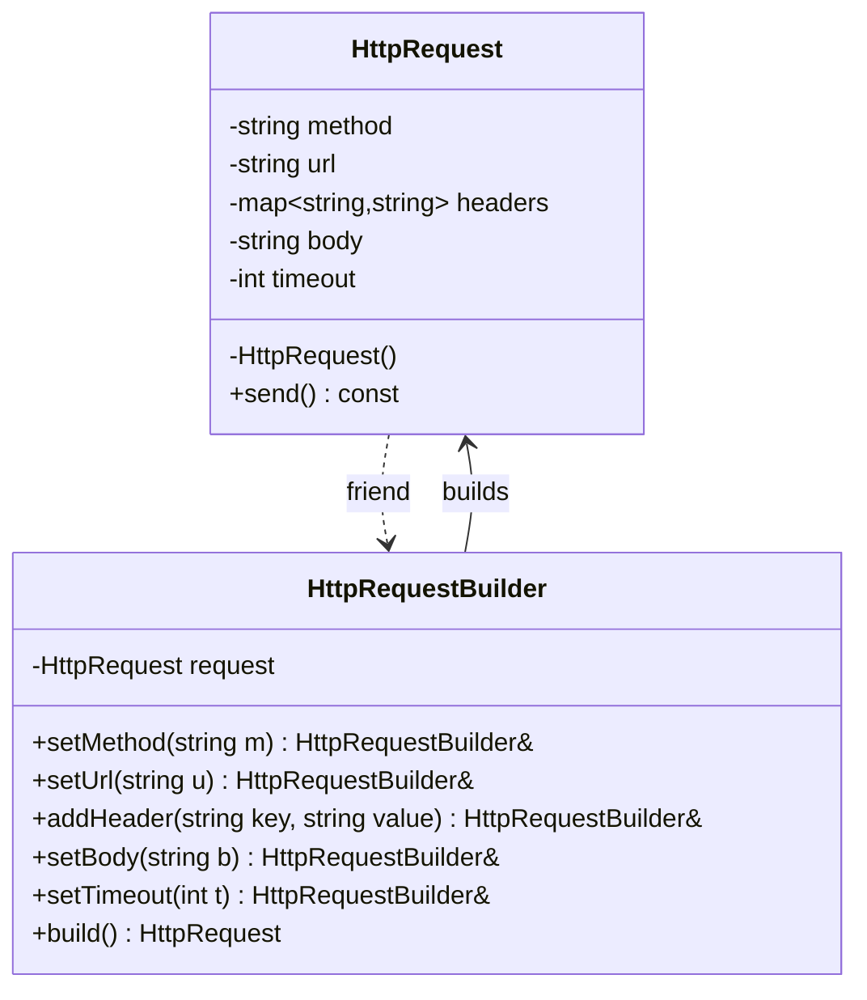
```mermaid
classDiagram
    class HttpRequest {
        -string method
        -string url
        -map~string,string~ headers
        -string body
        -int timeout
        -HttpRequest()
        +send() const
    }
    
    class HttpRequestBuilder {
        -HttpRequest request
        +setMethod(string m) HttpRequestBuilder&
        +setUrl(string u) HttpRequestBuilder&
        +addHeader(string key, string value) HttpRequestBuilder&
        +setBody(string b) HttpRequestBuilder&
        +setTimeout(int t) HttpRequestBuilder&
        +build() HttpRequest
    }
    
    HttpRequestBuilder --> HttpRequest : builds
    HttpRequest ..> HttpRequestBuilder : friend
```

**Code:**
```cpp
#include <iostream>
#include <string>
#include <map>
using namespace std;

class HttpRequest {
private:
    string method;
    string url;
    map<string, string> headers;
    string body;
    int timeout;
    
    HttpRequest() : method("GET"), timeout(30) {}
    
public:
    friend class HttpRequestBuilder;
    
    void send() const {
        cout << "\n=== HTTP Request ===\n";
        cout << method << " " << url << "\n";
        cout << "Timeout: " << timeout << "s\n";
        
        if (!headers.empty()) {
            cout << "Headers:\n";
            for (const auto& [key, value] : headers) {
                cout << "  " << key << ": " << value << "\n";
            }
        }
        
        if (!body.empty()) {
            cout << "Body: " << body << "\n";
        }
        cout << "====================\n";
    }
};

class HttpRequestBuilder {
private:
    HttpRequest request;
    
public:
    HttpRequestBuilder& setMethod(const string& m) {
        request.method = m;
        return *this;
    }
    
    HttpRequestBuilder& setUrl(const string& u) {
        request.url = u;
        return *this;
    }
    
    HttpRequestBuilder& addHeader(const string& key, const string& value) {
        request.headers[key] = value;
        return *this;
    }
    
    HttpRequestBuilder& setBody(const string& b) {
        request.body = b;
        return *this;
    }
    
    HttpRequestBuilder& setTimeout(int t) {
        request.timeout = t;
        return *this;
    }
    
    HttpRequest build() {
        return request;
    }
};

int main() {
    // Simple GET request
    HttpRequest getRequest = HttpRequestBuilder()
        .setMethod("GET")
        .setUrl("https://api.example.com/users")
        .addHeader("Accept", "application/json")
        .build();
    
    // Complex POST request
    HttpRequest postRequest = HttpRequestBuilder()
        .setMethod("POST")
        .setUrl("https://api.example.com/users")
        .addHeader("Content-Type", "application/json")
        .addHeader("Authorization", "Bearer token123")
        .setBody("{\"name\":\"John\",\"age\":30}")
        .setTimeout(60)
        .build();
    
    getRequest.send();
    postRequest.send();
    
    return 0;
}
```

---

#### **Director Pattern (GoF Variant):**

**UML Diagram:**
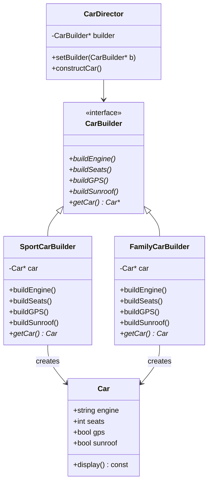
```mermaid
classDiagram
    class Car {
        +string engine
        +int seats
        +bool gps
        +bool sunroof
        +display() const
    }
    
    class CarBuilder {
        <<interface>>
        +buildEngine()*
        +buildSeats()*
        +buildGPS()*
        +buildSunroof()*
        +getCar()* Car*
    }
    
    class SportCarBuilder {
        -Car* car
        +buildEngine()
        +buildSeats()
        +buildGPS()
        +buildSunroof()
        +getCar() Car*
    }
    
    class FamilyCarBuilder {
        -Car* car
        +buildEngine()
        +buildSeats()
        +buildGPS()
        +buildSunroof()
        +getCar() Car*
    }
    
    class CarDirector {
        -CarBuilder* builder
        +setBuilder(CarBuilder* b)
        +constructCar()
    }
    
    CarBuilder <|-- SportCarBuilder
    CarBuilder <|-- FamilyCarBuilder
    CarDirector --> CarBuilder
    SportCarBuilder --> Car : creates
    FamilyCarBuilder --> Car : creates
```

**Code:**
```cpp
#include <iostream>
#include <memory>
using namespace std;

class Car {
public:
    string engine;
    int seats;
    bool gps;
    bool sunroof;
    
    void display() const {
        cout << "Car: " << engine << " engine, "
             << seats << " seats";
        if (gps) cout << ", GPS";
        if (sunroof) cout << ", Sunroof";
        cout << "\n";
    }
};

class CarBuilder {
public:
    virtual void buildEngine() = 0;
    virtual void buildSeats() = 0;
    virtual void buildGPS() = 0;
    virtual void buildSunroof() = 0;
    virtual Car* getCar() = 0;
    virtual ~CarBuilder() = default;
};

class SportCarBuilder : public CarBuilder {
private:
    Car* car;
public:
    SportCarBuilder() { car = new Car(); }
    
    void buildEngine() override {
        car->engine = "V8";
    }
    void buildSeats() override {
        car->seats = 2;
    }
    void buildGPS() override {
        car->gps = true;
    }
    void buildSunroof() override {
        car->sunroof = false;
    }
    Car* getCar() override {
        return car;
    }
};

class FamilyCarBuilder : public CarBuilder {
private:
    Car* car;
public:
    FamilyCarBuilder() { car = new Car(); }
    
    void buildEngine() override {
        car->engine = "V6";
    }
    void buildSeats() override {
        car->seats = 7;
    }
    void buildGPS() override {
        car->gps = true;
    }
    void buildSunroof() override {
        car->sunroof = true;
    }
    Car* getCar() override {
        return car;
    }
};

// Director
class CarDirector {
private:
    CarBuilder* builder;
public:
    void setBuilder(CarBuilder* b) {
        builder = b;
    }
    
    void constructCar() {
        builder->buildEngine();
        builder->buildSeats();
        builder->buildGPS();
        builder->buildSunroof();
    }
};

int main() {
    CarDirector director;
    
    SportCarBuilder sportBuilder;
    director.setBuilder(&sportBuilder);
    director.constructCar();
    Car* sportCar = sportBuilder.getCar();
    sportCar->display();
    
    FamilyCarBuilder familyBuilder;
    director.setBuilder(&familyBuilder);
    director.constructCar();
    Car* familyCar = familyBuilder.getCar();
    familyCar->display();
    
    delete sportCar;
    delete familyCar;
    
    return 0;
}
```

---

### **Advantages:**
✅ Clear, readable object construction  
✅ Avoids telescoping constructors  
✅ Supports step-by-step construction  
✅ Can create different representations  
✅ Immutable objects possible  

### **Disadvantages:**
❌ More code to write  
❌ Adds complexity for simple objects  

### **When to Use:**
- Object has many optional parameters
- Complex construction process
- Need immutable objects
- Want readable, self-documenting code

### **Interview Tips:**
- Explain **fluent interface** (method chaining)
- Discuss **immutability** advantages
- Show how it solves **telescoping constructor problem**
- Compare with **Factory** (complex construction vs simple creation)

---

## 5. PROTOTYPE PATTERN ⭐

### **Problem:**
You need to create new objects by **copying existing objects** (cloning) instead of creating from scratch. Useful when object creation is expensive.

**Real-world scenarios:**
- Copying complex configurations
- Cloning game characters with same attributes
- Creating document templates
- Duplicating database records

**Issues without Prototype:**
```cpp
// ❌ PROBLEM: Expensive object creation
ComplexObject* obj1 = new ComplexObject();
obj1->loadHugeDataFromDatabase();  // Takes 5 seconds!
obj1->processComplexCalculations();  // Takes 3 seconds!

// Need another similar object
ComplexObject* obj2 = new ComplexObject();
obj2->loadHugeDataFromDatabase();  // Another 5 seconds!
obj2->processComplexCalculations();  // Another 3 seconds!

// Could have just cloned obj1! ✅
```

---

### **Solution:**

**Key Concepts:**
1. Declare clone() method in base class
2. Derived classes implement cloning
3. Copy existing object instead of creating new
4. Preserves object state

---

### **Implementation:**

**UML Diagram:**
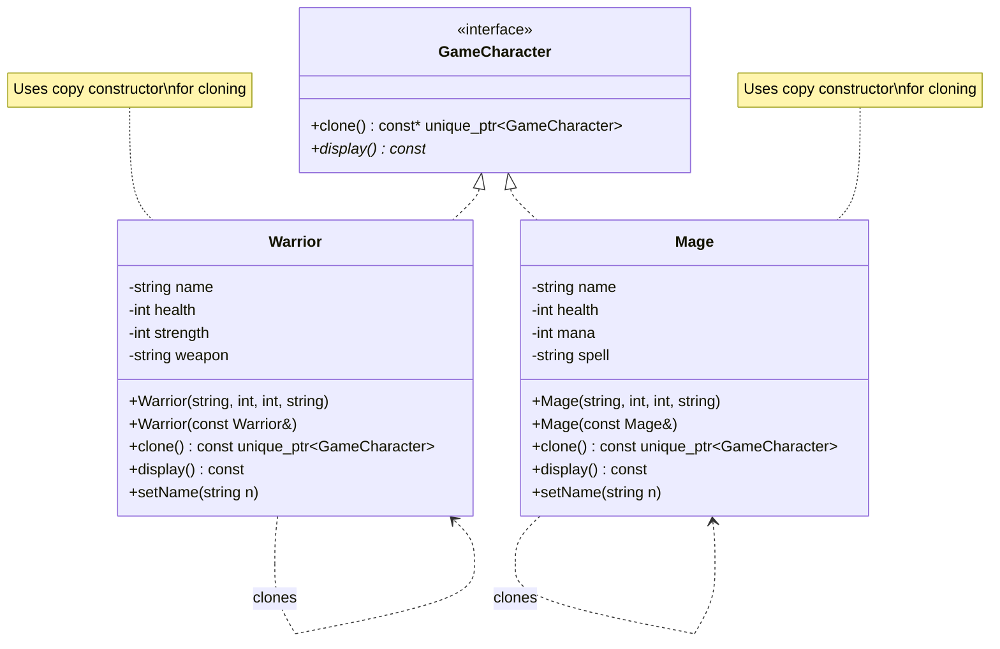
```mermaid
classDiagram
    class GameCharacter {
        <<interface>>
        +clone() const* unique_ptr~GameCharacter~
        +display() const*
    }
    
    class Warrior {
        -string name
        -int health
        -int strength
        -string weapon
        +Warrior(string, int, int, string)
        +Warrior(const Warrior&)
        +clone() const unique_ptr~GameCharacter~
        +display() const
        +setName(string n)
    }
    
    class Mage {
        -string name
        -int health
        -int mana
        -string spell
        +Mage(string, int, int, string)
        +Mage(const Mage&)
        +clone() const unique_ptr~GameCharacter~
        +display() const
        +setName(string n)
    }
    
    GameCharacter <|.. Warrior
    GameCharacter <|.. Mage
    Warrior ..> Warrior : clones
    Mage ..> Mage : clones
    
    note for Warrior "Uses copy constructor\nfor cloning"
    note for Mage "Uses copy constructor\nfor cloning"
```

**Code:**
```cpp
#include <iostream>
#include <string>
#include <memory>
using namespace std;

// Prototype interface
class GameCharacter {
public:
    virtual unique_ptr<GameCharacter> clone() const = 0;
    virtual void display() const = 0;
    virtual ~GameCharacter() = default;
};

// Concrete prototype
class Warrior : public GameCharacter {
private:
    string name;
    int health;
    int strength;
    string weapon;
    
public:
    Warrior(string n, int h, int s, string w)
        : name(n), health(h), strength(s), weapon(w) {}
    
    // Copy constructor
    Warrior(const Warrior& other)
        : name(other.name), health(other.health),
          strength(other.strength), weapon(other.weapon) {}
    
    unique_ptr<GameCharacter> clone() const override {
        return make_unique<Warrior>(*this);  // Use copy constructor
    }
    
    void display() const override {
        cout << "Warrior: " << name
             << " (HP:" << health
             << ", STR:" << strength
             << ", Weapon:" << weapon << ")\n";
    }
    
    void setName(const string& n) { name = n; }
};

class Mage : public GameCharacter {
private:
    string name;
    int health;
    int mana;
    string spell;
    
public:
    Mage(string n, int h, int m, string s)
        : name(n), health(h), mana(m), spell(s) {}
    
    Mage(const Mage& other)
        : name(other.name), health(other.health),
          mana(other.mana), spell(other.spell) {}
    
    unique_ptr<GameCharacter> clone() const override {
        return make_unique<Mage>(*this);
    }
    
    void display() const override {
        cout << "Mage: " << name
             << " (HP:" << health
             << ", MANA:" << mana
             << ", Spell:" << spell << ")\n";
    }
    
    void setName(const string& n) { name = n; }
};

int main() {
    // Create prototypes
    auto warriorPrototype = make_unique<Warrior>("Template Warrior", 100, 50, "Sword");
    auto magePrototype = make_unique<Mage>("Template Mage", 80, 150, "Fireball");
    
    // Clone to create new characters
    auto warrior1 = warriorPrototype->clone();
    auto warrior2 = warriorPrototype->clone();
    auto mage1 = magePrototype->clone();
    
    // Customize clones
    static_cast<Warrior*>(warrior1.get())->setName("Aragorn");
    static_cast<Warrior*>(warrior2.get())->setName("Boromir");
    static_cast<Mage*>(mage1.get())->setName("Gandalf");
    
    // Display all
    warriorPrototype->display();
    warrior1->display();
    warrior2->display();
    magePrototype->display();
    mage1->display();
    
    return 0;
}

/* Output:
Warrior: Template Warrior (HP:100, STR:50, Weapon:Sword)
Warrior: Aragorn (HP:100, STR:50, Weapon:Sword)
Warrior: Boromir (HP:100, STR:50, Weapon:Sword)
Mage: Template Mage (HP:80, MANA:150, Spell:Fireball)
Mage: Gandalf (HP:80, MANA:150, Spell:Fireball)
*/
```

---

### **Advantages:**
✅ Avoids expensive object creation  
✅ Reduces initialization code  
✅ Can add/remove objects at runtime  
✅ Alternative to subclassing  

### **Disadvantages:**
❌ Cloning complex objects with circular references is difficult  
❌ Need to implement clone() for each class  

### **When to Use:**
- Object creation is expensive
- Need many objects with similar configurations
- Want to avoid Factory hierarchies

### **Interview Tips:**
- Explain **shallow vs deep copy**
- Discuss **copy constructor** usage
- Compare with **Factory patterns**

---

# BEHAVIORAL PATTERNS

---

## 6. OBSERVER PATTERN ⭐⭐⭐

### **Problem:**
When **one object's state changes**, multiple dependent objects need to be **notified automatically**. Avoid tight coupling between objects.

**Real-world scenarios:**
- Event handling systems (button click → multiple handlers)
- Stock market (price changes → notify all subscribers)
- Weather station (temperature → update displays)
- Social media (post → notify all followers)
- MVC architecture (Model changes → update Views)

**Issues without Observer:**
```cpp
// ❌ PROBLEM: Tight coupling
class WeatherStation {
    PhoneDisplay phone;
    WebDisplay web;
    TVDisplay tv;
    
    void temperatureChanged(int temp) {
        phone.update(temp);  // Tightly coupled!
        web.update(temp);    // Adding display = modify this class
        tv.update(temp);
    }
};
```

---

### **Solution:**

**Key Concepts:**
1. Subject maintains list of observers
2. Observers register/unregister with subject
3. Subject notifies all observers when state changes
4. Loose coupling (subject doesn't know observer details)

---

### **Implementation:**

**UML Diagram:**
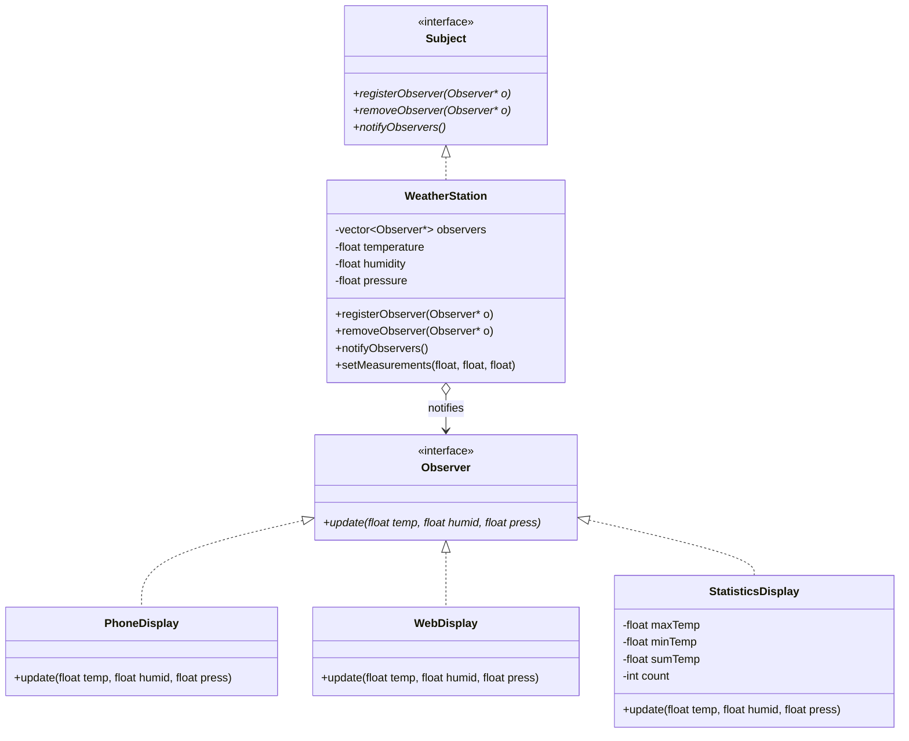
```mermaid
classDiagram
    class Observer {
        <<interface>>
        +update(float temp, float humid, float press)*
    }
    
    class Subject {
        <<interface>>
        +registerObserver(Observer* o)*
        +removeObserver(Observer* o)*
        +notifyObservers()*
    }
    
    class WeatherStation {
        -vector~Observer*~ observers
        -float temperature
        -float humidity
        -float pressure
        +registerObserver(Observer* o)
        +removeObserver(Observer* o)
        +notifyObservers()
        +setMeasurements(float, float, float)
    }
    
    class PhoneDisplay {
        +update(float temp, float humid, float press)
    }
    
    class WebDisplay {
        +update(float temp, float humid, float press)
    }
    
    class StatisticsDisplay {
        -float maxTemp
        -float minTemp
        -float sumTemp
        -int count
        +update(float temp, float humid, float press)
    }
    
    Subject <|.. WeatherStation
    Observer <|.. PhoneDisplay
    Observer <|.. WebDisplay
    Observer <|.. StatisticsDisplay
    WeatherStation o--> Observer : notifies
```

**Code:**
```cpp
#include <iostream>
#include <vector>
#include <algorithm>
#include <string>
using namespace std;

// Observer interface
class Observer {
public:
    virtual void update(float temperature, float humidity, float pressure) = 0;
    virtual ~Observer() = default;
};

// Subject interface
class Subject {
public:
    virtual void registerObserver(Observer* o) = 0;
    virtual void removeObserver(Observer* o) = 0;
    virtual void notifyObservers() = 0;
    virtual ~Subject() = default;
};

// Concrete Subject
class WeatherStation : public Subject {
private:
    vector<Observer*> observers;
    float temperature;
    float humidity;
    float pressure;
    
public:
    void registerObserver(Observer* o) override {
        observers.push_back(o);
        cout << "Observer registered\n";
    }
    
    void removeObserver(Observer* o) override {
        observers.erase(
            remove(observers.begin(), observers.end(), o),
            observers.end()
        );
        cout << "Observer removed\n";
    }
    
    void notifyObservers() override {
        for (Observer* observer : observers) {
            observer->update(temperature, humidity, pressure);
        }
    }
    
    void measurementsChanged() {
        notifyObservers();
    }
    
    void setMeasurements(float temp, float humid, float press) {
        temperature = temp;
        humidity = humid;
        pressure = press;
        measurementsChanged();
    }
};

// Concrete Observers
class PhoneDisplay : public Observer {
public:
    void update(float temp, float humid, float press) override {
        cout << "\n[Phone Display]"
             << "\nTemperature: " << temp << "°C"
             << "\nHumidity: " << humid << "%"
             << "\nPressure: " << press << " hPa\n";
    }
};

class WebDisplay : public Observer {
public:
    void update(float temp, float humid, float press) override {
        cout << "\n[Web Dashboard]"
             << "\nCurrent: " << temp << "°C"
             << "\nFeels like: " << (temp - 2) << "°C\n";
    }
};

class StatisticsDisplay : public Observer {
private:
    float maxTemp = -100;
    float minTemp = 100;
    float sumTemp = 0;
    int count = 0;
    
public:
    void update(float temp, float humid, float press) override {
        sumTemp += temp;
        count++;
        if (temp > maxTemp) maxTemp = temp;
        if (temp < minTemp) minTemp = temp;
        
        cout << "\n[Statistics]"
             << "\nAvg: " << (sumTemp / count) << "°C"
             << "\nMax: " << maxTemp << "°C"
             << "\nMin: " << minTemp << "°C\n";
    }
};

int main() {
    WeatherStation weatherStation;
    
    PhoneDisplay phoneDisplay;
    WebDisplay webDisplay;
    StatisticsDisplay statsDisplay;
    
    // Register observers
    weatherStation.registerObserver(&phoneDisplay);
    weatherStation.registerObserver(&webDisplay);
    weatherStation.registerObserver(&statsDisplay);
    
    // Simulate weather changes
    cout << "\n=== Weather Update 1 ===";
    weatherStation.setMeasurements(25.5f, 65.0f, 1013.2f);
    
    cout << "\n=== Weather Update 2 ===";
    weatherStation.setMeasurements(28.0f, 70.0f, 1012.8f);
    
    // Remove an observer
    cout << "\n=== Removing Web Display ===\n";
    weatherStation.removeObserver(&webDisplay);
    
    cout << "\n=== Weather Update 3 ===";
    weatherStation.setMeasurements(22.0f, 60.0f, 1015.0f);
    
    return 0;
}
```

---

### **Modern C++ Implementation (with std::function):**

**UML Diagram:**
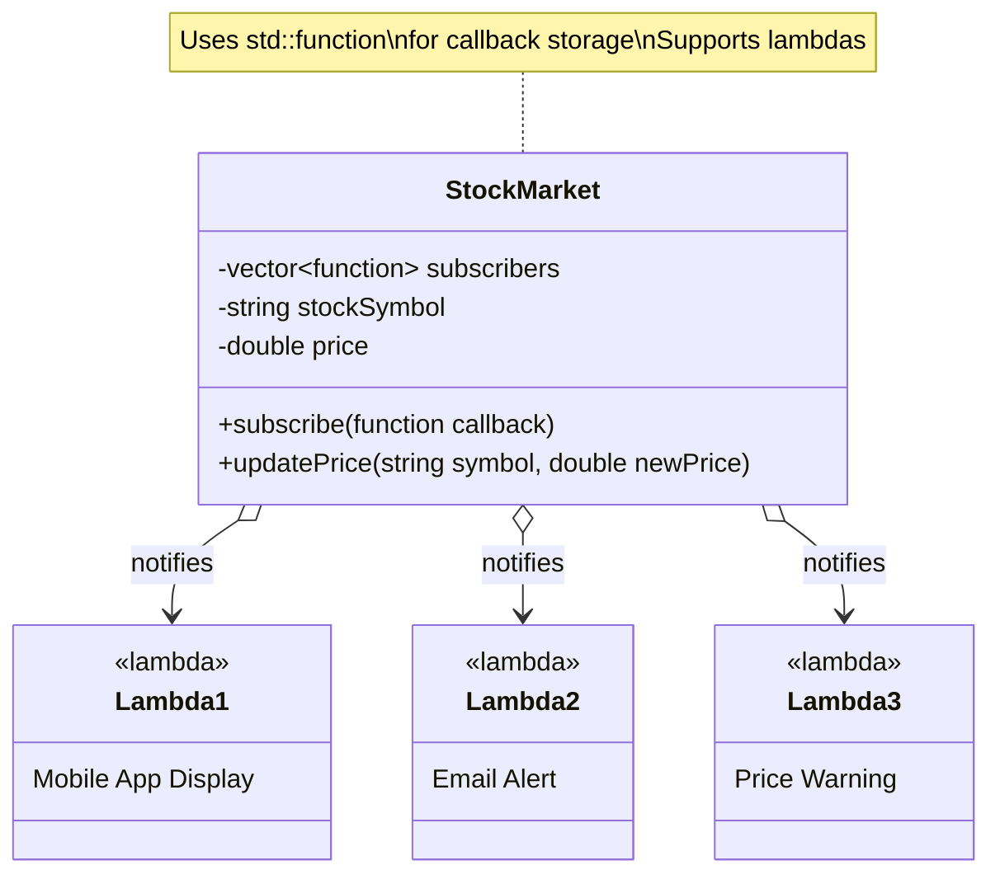
```mermaid
classDiagram
    class StockMarket {
        -vector~function~ subscribers
        -string stockSymbol
        -double price
        +subscribe(function callback)
        +updatePrice(string symbol, double newPrice)
    }
    
    class Lambda1 {
        <<lambda>>
        Mobile App Display
    }
    
    class Lambda2 {
        <<lambda>>
        Email Alert
    }
    
    class Lambda3 {
        <<lambda>>
        Price Warning
    }
    
    StockMarket o--> Lambda1 : notifies
    StockMarket o--> Lambda2 : notifies
    StockMarket o--> Lambda3 : notifies
    
    note for StockMarket "Uses std::function\nfor callback storage\nSupports lambdas"
```

**Code:**
```cpp
#include <iostream>
#include <vector>
#include <functional>
using namespace std;

class StockMarket {
private:
    vector<function<void(string, double)>> subscribers;
    string stockSymbol;
    double price;
    
public:
    // Subscribe with lambda or function
    void subscribe(function<void(string, double)> callback) {
        subscribers.push_back(callback);
    }
    
    void updatePrice(const string& symbol, double newPrice) {
        stockSymbol = symbol;
        price = newPrice;
        
        // Notify all subscribers
        for (auto& subscriber : subscribers) {
            subscriber(stockSymbol, price);
        }
    }
};

int main() {
    StockMarket market;
    
    // Subscribe with lambdas
    market.subscribe([](string symbol, double price) {
        cout << "[Mobile App] " << symbol << ": $" << price << "\n";
    });
    
    market.subscribe([](string symbol, double price) {
        cout << "[Email Alert] Stock " << symbol
             << " reached $" << price << "\n";
    });
    
    market.subscribe([](string symbol, double price) {
        if (price > 150.0) {
            cout << "[Warning] " << symbol
                 << " exceeded threshold: $" << price << "\n";
        }
    });
    
    // Trigger updates
    cout << "=== Price Update 1 ===\n";
    market.updatePrice("AAPL", 145.50);
    
    cout << "\n=== Price Update 2 ===\n";
    market.updatePrice("AAPL", 155.75);
    
    return 0;
}
```

---

### **Advantages:**
✅ Loose coupling between subject and observers  
✅ Dynamic relationships (add/remove at runtime)  
✅ Broadcast communication  
✅ Supports event-driven programming  

### **Disadvantages:**
❌ Observers notified in unpredictable order  
❌ Memory leaks if observers not removed  
❌ Can cause cascading updates  

### **When to Use:**
- Event handling systems
- Real-time data feeds
- MVC/MVVM architectures
- Publish-subscribe systems

### **Interview Tips:**
- Explain **push vs pull** models
- Discuss **memory management** (weak_ptr in C++)
- Show **modern C++ version** with std::function
- Compare with **Mediator pattern**

---

## 7. STRATEGY PATTERN ⭐⭐⭐

### **Problem:**
You need to use **different algorithms** (strategies) and be able to **switch between them at runtime**. Avoid using multiple conditionals.

**Real-world scenarios:**
- Different sorting algorithms (QuickSort, MergeSort, BubbleSort)
- Payment methods (Credit Card, PayPal, Crypto)
- Compression algorithms (ZIP, RAR, 7Z)
- Routing algorithms (Fastest, Shortest, Scenic)
- Pricing strategies (Regular, Student, Senior discount)

**Issues without Strategy:**
```cpp
// ❌ PROBLEM: Messy conditionals
void sortData(vector<int>& data, string algorithm) {
    if (algorithm == "quick") {
        // QuickSort implementation
    } else if (algorithm == "merge") {
        // MergeSort implementation
    } else if (algorithm == "bubble") {
        // BubbleSort implementation
    }
    // Adding new algorithm = modify this function!
    // Violates Open-Closed Principle
}
```

---

### **Solution:**

**Key Concepts:**
1. Define strategy interface
2. Implement concrete strategies
3. Context uses strategy through interface
4. Switch strategies at runtime

---

### **Implementation:**

**UML Diagram:**
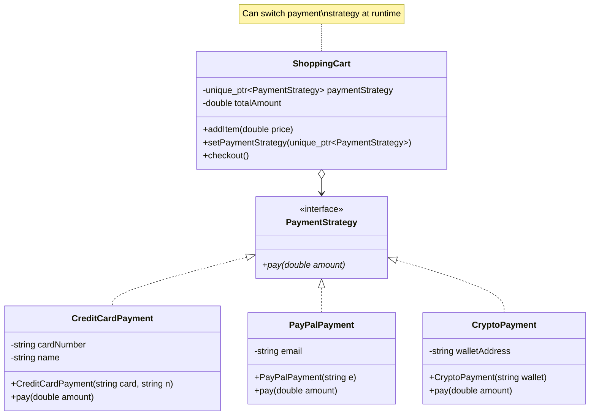
```mermaid
classDiagram
    class PaymentStrategy {
        <<interface>>
        +pay(double amount)*
    }
    
    class CreditCardPayment {
        -string cardNumber
        -string name
        +CreditCardPayment(string card, string n)
        +pay(double amount)
    }
    
    class PayPalPayment {
        -string email
        +PayPalPayment(string e)
        +pay(double amount)
    }
    
    class CryptoPayment {
        -string walletAddress
        +CryptoPayment(string wallet)
        +pay(double amount)
    }
    
    class ShoppingCart {
        -unique_ptr~PaymentStrategy~ paymentStrategy
        -double totalAmount
        +addItem(double price)
        +setPaymentStrategy(unique_ptr~PaymentStrategy~)
        +checkout()
    }
    
    PaymentStrategy <|.. CreditCardPayment
    PaymentStrategy <|.. PayPalPayment
    PaymentStrategy <|.. CryptoPayment
    ShoppingCart o--> PaymentStrategy
    
    note for ShoppingCart "Can switch payment\nstrategy at runtime"
```

**Code:**
```cpp
#include <iostream>
#include <memory>
using namespace std;

// Strategy interface
class PaymentStrategy {
public:
    virtual void pay(double amount) = 0;
    virtual ~PaymentStrategy() = default;
};

// Concrete strategies
class CreditCardPayment : public PaymentStrategy {
private:
    string cardNumber;
    string name;
    
public:
    CreditCardPayment(string card, string n)
        : cardNumber(card), name(n) {}
    
    void pay(double amount) override {
        cout << "Paid $" << amount
             << " using Credit Card ending in "
             << cardNumber.substr(cardNumber.length() - 4) << "\n";
    }
};

class PayPalPayment : public PaymentStrategy {
private:
    string email;
    
public:
    PayPalPayment(string e) : email(e) {}
    
    void pay(double amount) override {
        cout << "Paid $" << amount
             << " using PayPal account " << email << "\n";
    }
};

class CryptoPayment : public PaymentStrategy {
private:
    string walletAddress;
    
public:
    CryptoPayment(string wallet) : walletAddress(wallet) {}
    
    void pay(double amount) override {
        cout << "Paid $" << amount
             << " using Crypto wallet "
             << walletAddress.substr(0, 8) << "...\n";
    }
};

// Context
class ShoppingCart {
private:
    unique_ptr<PaymentStrategy> paymentStrategy;
    double totalAmount;
    
public:
    ShoppingCart() : totalAmount(0) {}
    
    void addItem(double price) {
        totalAmount += price;
        cout << "Item added: $" << price << "\n";
    }
    
    void setPaymentStrategy(unique_ptr<PaymentStrategy> strategy) {
        paymentStrategy = move(strategy);
    }
    
    void checkout() {
        if (paymentStrategy) {
            cout << "\nTotal: $" << totalAmount << "\n";
            paymentStrategy->pay(totalAmount);
            cout << "Payment successful!\n";
        } else {
            cout << "Please select payment method\n";
        }
    }
};

int main() {
    ShoppingCart cart;
    
    // Add items
    cart.addItem(29.99);
    cart.addItem(45.50);
    cart.addItem(15.00);
    
    // Customer chooses payment method
    cout << "\n=== Checkout with Credit Card ===\n";
    cart.setPaymentStrategy(
        make_unique<CreditCardPayment>("1234567890123456", "John Doe")
    );
    cart.checkout();
    
    // Try different payment method
    ShoppingCart cart2;
    cart2.addItem(99.99);
    
    cout << "\n=== Checkout with PayPal ===\n";
    cart2.setPaymentStrategy(
        make_unique<PayPalPayment>("user@example.com")
    );
    cart2.checkout();
    
    // Another payment method
    ShoppingCart cart3;
    cart3.addItem(199.99);
    
    cout << "\n=== Checkout with Crypto ===\n";
    cart3.setPaymentStrategy(
        make_unique<CryptoPayment>("1A2B3C4D5E6F7G8H9I0J")
    );
    cart3.checkout();
    
    return 0;
}
```

---

### **Sorting Example:**

**UML Diagram:**
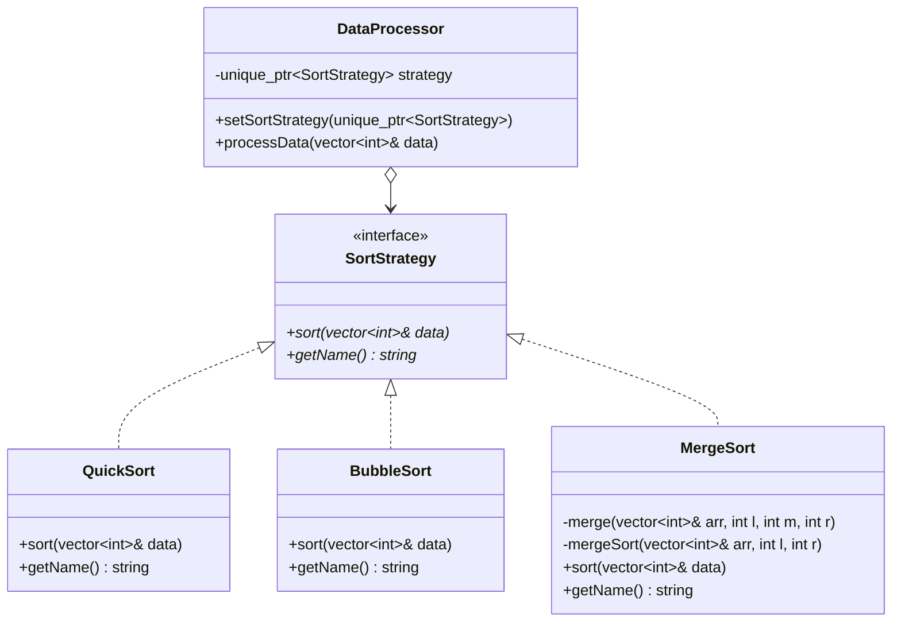
```mermaid
classDiagram
    class SortStrategy {
        <<interface>>
        +sort(vector~int~& data)*
        +getName()* string
    }
    
    class QuickSort {
        +sort(vector~int~& data)
        +getName() string
    }
    
    class BubbleSort {
        +sort(vector~int~& data)
        +getName() string
    }
    
    class MergeSort {
        -merge(vector~int~& arr, int l, int m, int r)
        -mergeSort(vector~int~& arr, int l, int r)
        +sort(vector~int~& data)
        +getName() string
    }
    
    class DataProcessor {
        -unique_ptr~SortStrategy~ strategy
        +setSortStrategy(unique_ptr~SortStrategy~)
        +processData(vector~int~& data)
    }
    
    SortStrategy <|.. QuickSort
    SortStrategy <|.. BubbleSort
    SortStrategy <|.. MergeSort
    DataProcessor o--> SortStrategy
```

**Code:**
```cpp
#include <iostream>
#include <vector>
#include <algorithm>
using namespace std;

// Strategy interface
class SortStrategy {
public:
    virtual void sort(vector<int>& data) = 0;
    virtual string getName() = 0;
    virtual ~SortStrategy() = default;
};

// Concrete strategies
class QuickSort : public SortStrategy {
public:
    void sort(vector<int>& data) override {
        // Use STL sort (typically QuickSort)
        std::sort(data.begin(), data.end());
    }
    
    string getName() override {
        return "QuickSort";
    }
};

class BubbleSort : public SortStrategy {
public:
    void sort(vector<int>& data) override {
        int n = data.size();
        for (int i = 0; i < n - 1; i++) {
            for (int j = 0; j < n - i - 1; j++) {
                if (data[j] > data[j + 1]) {
                    swap(data[j], data[j + 1]);
                }
            }
        }
    }
    
    string getName() override {
        return "BubbleSort";
    }
};

class MergeSort : public SortStrategy {
private:
    void merge(vector<int>& arr, int l, int m, int r) {
        vector<int> left(arr.begin() + l, arr.begin() + m + 1);
        vector<int> right(arr.begin() + m + 1, arr.begin() + r + 1);
        
        int i = 0, j = 0, k = l;
        while (i < left.size() && j < right.size()) {
            arr[k++] = (left[i] <= right[j]) ? left[i++] : right[j++];
        }
        while (i < left.size()) arr[k++] = left[i++];
        while (j < right.size()) arr[k++] = right[j++];
    }
    
    void mergeSort(vector<int>& arr, int l, int r) {
        if (l < r) {
            int m = l + (r - l) / 2;
            mergeSort(arr, l, m);
            mergeSort(arr, m + 1, r);
            merge(arr, l, m, r);
        }
    }
    
public:
    void sort(vector<int>& data) override {
        if (!data.empty()) {
            mergeSort(data, 0, data.size() - 1);
        }
    }
    
    string getName() override {
        return "MergeSort";
    }
};

// Context
class DataProcessor {
private:
    unique_ptr<SortStrategy> strategy;
    
public:
    void setSortStrategy(unique_ptr<SortStrategy> s) {
        strategy = move(s);
    }
    
    void processData(vector<int>& data) {
        if (strategy) {
            cout << "Sorting with " << strategy->getName() << "...\n";
            strategy->sort(data);
            
            cout << "Sorted: ";
            for (int num : data) {
                cout << num << " ";
            }
            cout << "\n";
        }
    }
};

int main() {
    vector<int> data1 = {64, 34, 25, 12, 22, 11, 90};
    vector<int> data2 = {5, 2, 8, 1, 9};
    vector<int> data3 = {100, 50, 75, 25, 10};
    
    DataProcessor processor;
    
    // Use QuickSort
    processor.setSortStrategy(make_unique<QuickSort>());
    processor.processData(data1);
    
    cout << "\n";
    
    // Switch to BubbleSort
    processor.setSortStrategy(make_unique<BubbleSort>());
    processor.processData(data2);
    
    cout << "\n";
    
    // Switch to MergeSort
    processor.setSortStrategy(make_unique<MergeSort>());
    processor.processData(data3);
    
    return 0;
}
```

---

### **Advantages:**
✅ Algorithms can be switched at runtime  
✅ Follows Open-Closed Principle  
✅ Eliminates conditional statements  
✅ Families of algorithms easily managed  

### **Disadvantages:**
❌ Clients must know different strategies  
❌ Increases number of objects  

### **When to Use:**
- Multiple versions of algorithm needed
- Want to hide algorithm implementation
- Need to switch algorithms at runtime
- Many conditional statements based on type

### **Interview Tips:**
- Compare with **State pattern** (different intent)
- Show how it follows **Open-Closed Principle**
- Discuss **C++ std::function** as lightweight alternative
- Real example: STL's sort with custom comparators

---

## 8. COMMAND PATTERN ⭐⭐

### **Problem:**
You need to **encapsulate requests as objects**, allowing you to **queue, log, or undo** operations. Decouple sender from receiver.

**Real-world scenarios:**
- Undo/Redo functionality in editors
- Transaction systems
- Task queues
- Macro recording
- GUI buttons/menu items

**Issues without Command:**
```cpp
// ❌ PROBLEM: Tight coupling
class Button {
    Editor* editor;
    
    void onClick() {
        editor->copy();  // Tightly coupled to Editor
        // What if button needs to do something else?
        // How to undo?
    }
};
```

---

### **Solution:**

**Key Concepts:**
1. Encapsulate request as object
2. Command interface with execute()
3. Invoker calls execute() without knowing details
4. Supports undo/redo

---

### **Implementation:**

**UML Diagram:**
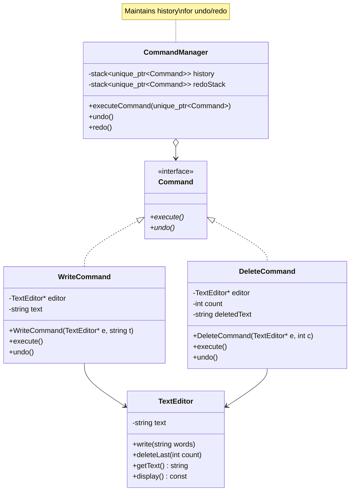
```mermaid
classDiagram
    class Command {
        <<interface>>
        +execute()*
        +undo()*
    }
    
    class WriteCommand {
        -TextEditor* editor
        -string text
        +WriteCommand(TextEditor* e, string t)
        +execute()
        +undo()
    }
    
    class DeleteCommand {
        -TextEditor* editor
        -int count
        -string deletedText
        +DeleteCommand(TextEditor* e, int c)
        +execute()
        +undo()
    }
    
    class TextEditor {
        -string text
        +write(string words)
        +deleteLast(int count)
        +getText() string
        +display() const
    }
    
    class CommandManager {
        -stack~unique_ptr~Command~~ history
        -stack~unique_ptr~Command~~ redoStack
        +executeCommand(unique_ptr~Command~)
        +undo()
        +redo()
    }
    
    Command <|.. WriteCommand
    Command <|.. DeleteCommand
    WriteCommand --> TextEditor
    DeleteCommand --> TextEditor
    CommandManager o--> Command
    
    note for CommandManager "Maintains history\nfor undo/redo"
```

**Code:**
```cpp
#include <iostream>
#include <memory>
#include <stack>
#include <string>
using namespace std;

// Receiver
class TextEditor {
private:
    string text;
    
public:
    void write(const string& words) {
        text += words;
        cout << "Wrote: " << words << "\n";
    }
    
    void deleteLast(int count) {
        if (count <= text.length()) {
            text = text.substr(0, text.length() - count);
            cout << "Deleted " << count << " characters\n";
        }
    }
    
    string getText() const {
        return text;
    }
    
    void display() const {
        cout << "Current text: \"" << text << "\"\n";
    }
};

// Command interface
class Command {
public:
    virtual void execute() = 0;
    virtual void undo() = 0;
    virtual ~Command() = default;
};

// Concrete commands
class WriteCommand : public Command {
private:
    TextEditor* editor;
    string text;
    
public:
    WriteCommand(TextEditor* e, const string& t)
        : editor(e), text(t) {}
    
    void execute() override {
        editor->write(text);
    }
    
    void undo() override {
        editor->deleteLast(text.length());
    }
};

class DeleteCommand : public Command {
private:
    TextEditor* editor;
    int count;
    string deletedText;
    
public:
    DeleteCommand(TextEditor* e, int c)
        : editor(e), count(c) {}
    
    void execute() override {
        string currentText = editor->getText();
        if (count <= currentText.length()) {
            deletedText = currentText.substr(currentText.length() - count);
            editor->deleteLast(count);
        }
    }
    
    void undo() override {
        editor->write(deletedText);
    }
};

// Invoker
class CommandManager {
private:
    stack<unique_ptr<Command>> history;
    stack<unique_ptr<Command>> redoStack;
    
public:
    void executeCommand(unique_ptr<Command> cmd) {
        cmd->execute();
        history.push(move(cmd));
        
        // Clear redo stack on new command
        while (!redoStack.empty()) {
            redoStack.pop();
        }
    }
    
    void undo() {
        if (!history.empty()) {
            auto cmd = move(history.top());
            history.pop();
            
            cmd->undo();
            redoStack.push(move(cmd));
            cout << "Undo performed\n";
        } else {
            cout << "Nothing to undo\n";
        }
    }
    
    void redo() {
        if (!redoStack.empty()) {
            auto cmd = move(redoStack.top());
            redoStack.pop();
            
            cmd->execute();
            history.push(move(cmd));
            cout << "Redo performed\n";
        } else {
            cout << "Nothing to redo\n";
        }
    }
};

int main() {
    TextEditor editor;
    CommandManager manager;
    
    // Execute commands
    manager.executeCommand(make_unique<WriteCommand>(&editor, "Hello "));
    editor.display();
    
    manager.executeCommand(make_unique<WriteCommand>(&editor, "World!"));
    editor.display();
    
    manager.executeCommand(make_unique<DeleteCommand>(&editor, 6));
    editor.display();
    
    manager.executeCommand(make_unique<WriteCommand>(&editor, "C++!"));
    editor.display();
    
    // Undo operations
    cout << "\n=== Undoing ===\n";
    manager.undo();
    editor.display();
    
    manager.undo();
    editor.display();
    
    // Redo operations
    cout << "\n=== Redoing ===\n";
    manager.redo();
    editor.display();
    
    return 0;
}
```

---

### **Advantages:**
✅ Decouples sender from receiver  
✅ Supports undo/redo  
✅ Can queue/log commands  
✅ Composite commands possible  

### **Disadvantages:**
❌ Increases number of classes  
❌ More complex than direct calls  

### **When to Use:**
- Need undo/redo functionality
- Want to queue operations
- Need to log requests
- Macro recording
- Transactional systems

### **Interview Tips:**
- Emphasize **undo/redo** capability
- Discuss **memento pattern** for state storage
- Show **command queue** for async execution

---

## 9. TEMPLATE METHOD PATTERN ⭐⭐

### **Problem:**
You have an **algorithm with common steps** but some steps vary. Define the skeleton in base class, let subclasses override specific steps.

**Real-world scenarios:**
- Data processing pipelines
- Game AI (same decision algorithm, different implementations)
- Web frameworks (request handling flow)
- Testing frameworks (setup, execute, teardown)

---

### **Solution:**

**UML Diagram:**
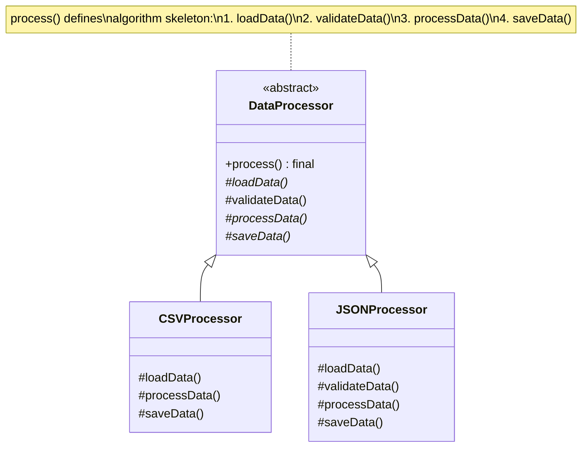
```mermaid
classDiagram
    class DataProcessor {
        <<abstract>>
        +process() final
        #loadData()*
        #validateData()
        #processData()*
        #saveData()*
    }
    
    class CSVProcessor {
        #loadData()
        #processData()
        #saveData()
    }
    
    class JSONProcessor {
        #loadData()
        #validateData()
        #processData()
        #saveData()
    }
    
    DataProcessor <|-- CSVProcessor
    DataProcessor <|-- JSONProcessor
    
    note for DataProcessor "process() defines\nalgorithm skeleton:\n1. loadData()\n2. validateData()\n3. processData()\n4. saveData()"
```

**Code:**
```cpp
#include <iostream>
using namespace std;

// Abstract class with template method
class DataProcessor {
public:
    // Template method - defines algorithm skeleton
    void process() {
        loadData();
        validateData();
        processData();
        saveData();
    }
    
    virtual ~DataProcessor() = default;
    
protected:
    virtual void loadData() = 0;
    virtual void processData() = 0;
    virtual void saveData() = 0;
    
    // Hook - can be overridden but not mandatory
    virtual void validateData() {
        cout << "Default validation\n";
    }
};

// Concrete implementations
class CSVProcessor : public DataProcessor {
protected:
    void loadData() override {
        cout << "Loading CSV file\n";
    }
    
    void processData() override {
        cout << "Processing CSV data\n";
    }
    
    void saveData() override {
        cout << "Saving to CSV\n";
    }
};

class JSONProcessor : public DataProcessor {
protected:
    void loadData() override {
        cout << "Loading JSON file\n";
    }
    
    void validateData() override {
        cout << "JSON schema validation\n";
    }
    
    void processData() override {
        cout << "Processing JSON data\n";
    }
    
    void saveData() override {
        cout << "Saving to JSON\n";
    }
};

int main() {
    cout << "=== Processing CSV ===\n";
    CSVProcessor csvProc;
    csvProc.process();
    
    cout << "\n=== Processing JSON ===\n";
    JSONProcessor jsonProc;
    jsonProc.process();
    
    return 0;
}
```

---

### **When to Use:**
- Common algorithm structure
- Some steps vary
- Want to prevent code duplication

---

## 10-15. OTHER PATTERNS (BRIEF)

Due to length constraints, here are the remaining patterns with UML diagrams:

---

### **10. STATE PATTERN** ⭐

**Problem:** Object behavior changes when internal state changes (appears to change class)

**UML Diagram:**
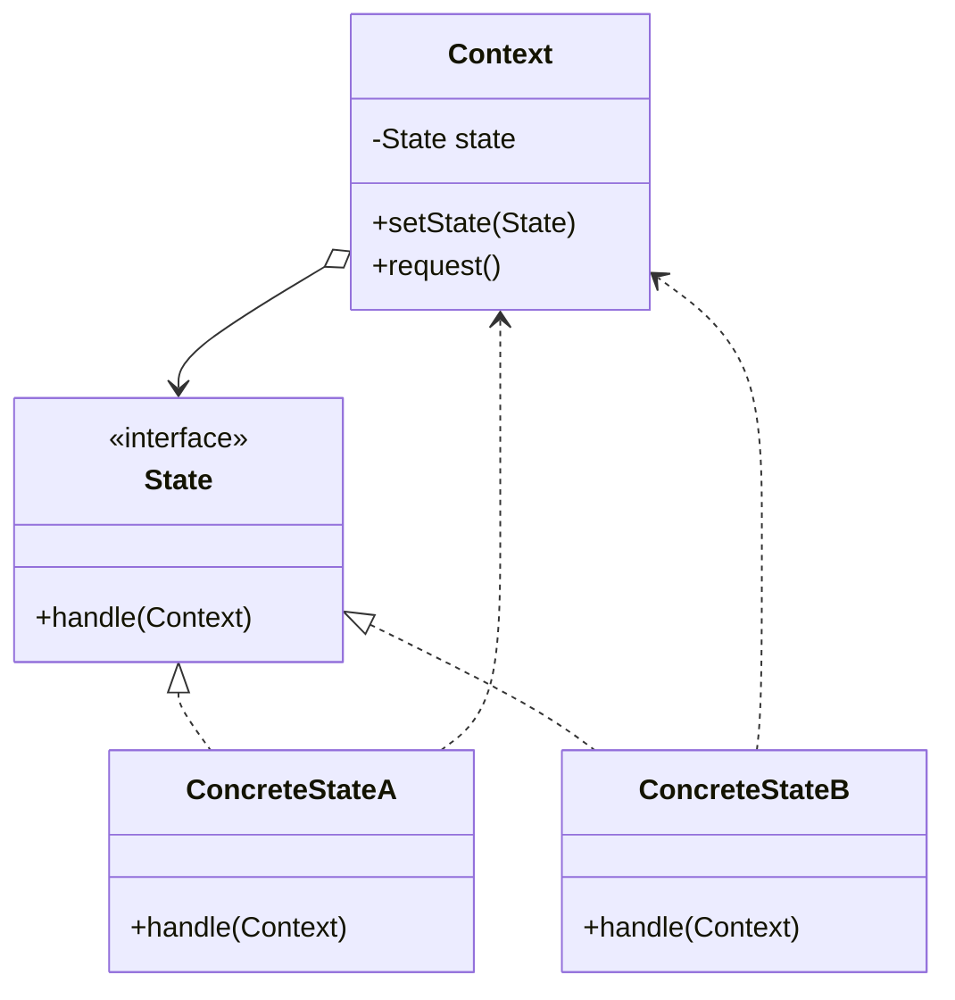
```mermaid
classDiagram
    class Context {
        -State state
        +setState(State)
        +request()
    }
    
    class State {
        <<interface>>
        +handle(Context)
    }
    
    class ConcreteStateA {
        +handle(Context)
    }
    
    class ConcreteStateB {
        +handle(Context)
    }
    
    Context o--> State
    State <|.. ConcreteStateA
    State <|.. ConcreteStateB
    ConcreteStateA ..> Context
    ConcreteStateB ..> Context
```

**Example:** TCP connection (Closed → Listen → Established), Vending machine states

---

### **11. CHAIN OF RESPONSIBILITY PATTERN** ⭐

**Problem:** Pass request along chain of handlers until one handles it

**UML Diagram:**
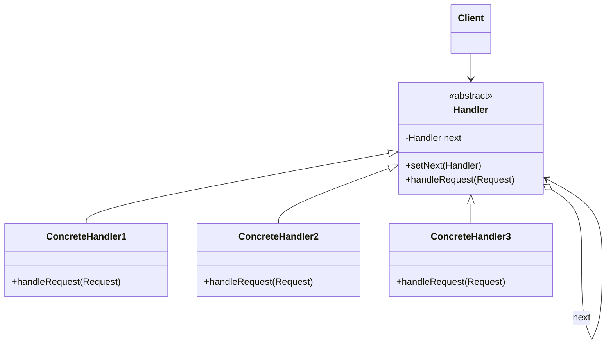
```mermaid
classDiagram
    class Handler {
        <<abstract>>
        -Handler next
        +setNext(Handler)
        +handleRequest(Request)
    }
    
    class ConcreteHandler1 {
        +handleRequest(Request)
    }
    
    class ConcreteHandler2 {
        +handleRequest(Request)
    }
    
    class ConcreteHandler3 {
        +handleRequest(Request)
    }
    
    class Client {
    }
    
    Handler <|-- ConcreteHandler1
    Handler <|-- ConcreteHandler2
    Handler <|-- ConcreteHandler3
    Handler o--> Handler : next
    Client --> Handler
```

**Example:** Logging levels (Debug → Info → Warning → Error), Exception handling, HTTP middleware

---

### **12. DECORATOR PATTERN** ⭐⭐

**Problem:** Add responsibilities to objects dynamically without affecting other objects

**UML Diagram:**
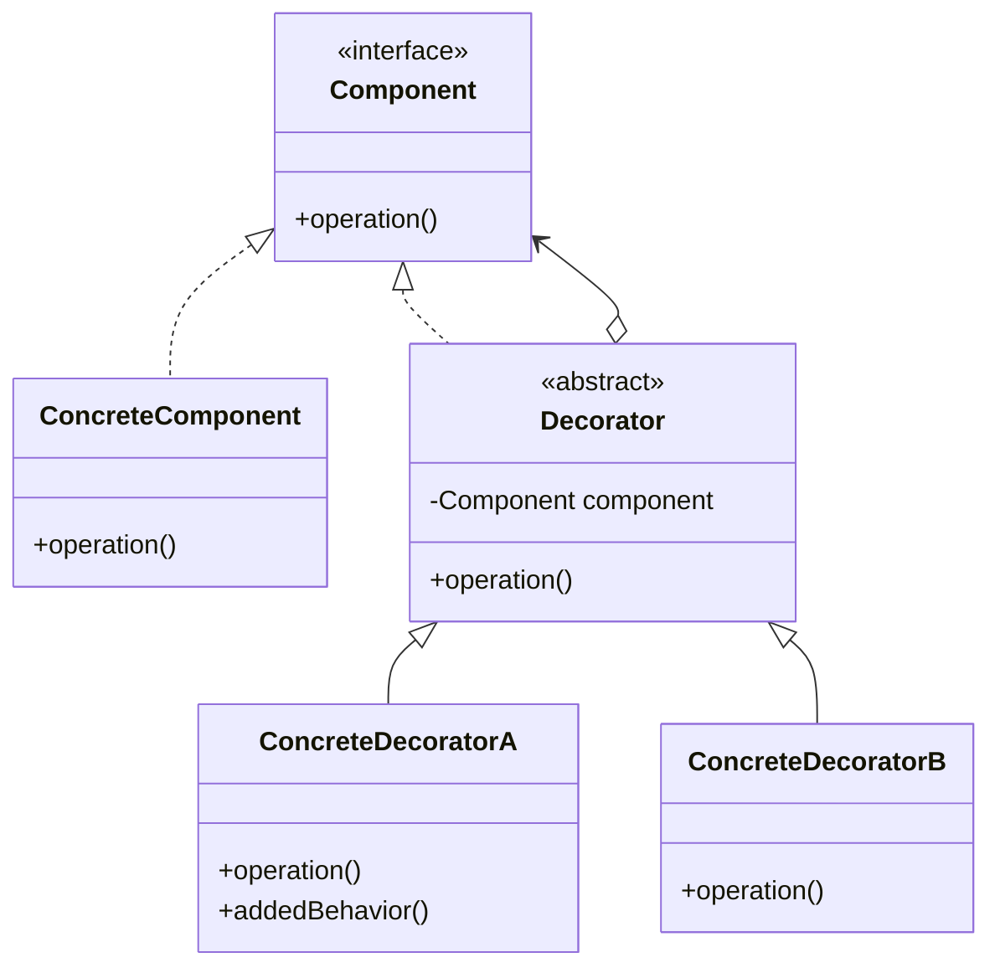
```mermaid
classDiagram
    class Component {
        <<interface>>
        +operation()
    }
    
    class ConcreteComponent {
        +operation()
    }
    
    class Decorator {
        <<abstract>>
        -Component component
        +operation()
    }
    
    class ConcreteDecoratorA {
        +operation()
        +addedBehavior()
    }
    
    class ConcreteDecoratorB {
        +operation()
    }
    
    Component <|.. ConcreteComponent
    Component <|.. Decorator
    Decorator o--> Component
    Decorator <|-- ConcreteDecoratorA
    Decorator <|-- ConcreteDecoratorB
```

**Example:** Java I/O streams (BufferedReader wraps FileReader), UI component decorators (scrollbar, border)

---

### **13. ADAPTER PATTERN** ⭐⭐

**Problem:** Make incompatible interfaces compatible (convert interface of class into another interface)

**UML Diagram:**
```mermaid
classDiagram
    class Target {
        <<interface>>
        +request()
    }
    
    class Adapter {
        -Adaptee adaptee
        +request()
    }
    
    class Adaptee {
        +specificRequest()
    }
    
    class Client {
    }
    
    Target <|.. Adapter
    Adapter --> Adaptee
    Client --> Target
    
    note for Adapter "Translates request()\nto specificRequest()"
```

**Example:** Power adapter (US plug → EU socket), Legacy code integration, Third-party library wrapper

---

### **14. FACADE PATTERN** ⭐

**Problem:** Provide simplified interface to complex subsystem

**UML Diagram:**
```mermaid
classDiagram
    class Facade {
        -SubsystemA subsystemA
        -SubsystemB subsystemB
        -SubsystemC subsystemC
        +operation1()
        +operation2()
    }
    
    class SubsystemA {
        +operationA1()
        +operationA2()
    }
    
    class SubsystemB {
        +operationB1()
        +operationB2()
    }
    
    class SubsystemC {
        +operationC1()
        +operationC2()
    }
    
    class Client {
    }
    
    Facade --> SubsystemA
    Facade --> SubsystemB
    Facade --> SubsystemC
    Client --> Facade
```

**Example:** Computer startup (simple powerOn() hides complex boot process), Video conversion library

---

### **15. PROXY PATTERN** ⭐

**Problem:** Provide placeholder/surrogate for another object to control access

**UML Diagram:**
```mermaid
classDiagram
    class Subject {
        <<interface>>
        +request()
    }
    
    class RealSubject {
        +request()
    }
    
    class Proxy {
        -RealSubject realSubject
        +request()
    }
    
    class Client {
    }
    
    Subject <|.. RealSubject
    Subject <|.. Proxy
    Proxy --> RealSubject
    Client --> Subject
    
    note for Proxy "Controls access to\nRealSubject\nCan add:\n- Lazy loading\n- Access control\n- Caching"
```

**Example:** Virtual proxy (lazy loading images), Protection proxy (access control), Remote proxy (RPC)

---

## 15. PROXY PATTERN ⭐

### **Problem:**
You need to **control access** to another object by providing a **placeholder or surrogate**. The proxy adds extra functionality like lazy loading, access control, caching, or logging without changing the real object.

**Real-world scenarios:**
- Virtual Proxy: Lazy loading expensive objects (large images, database connections)
- Protection Proxy: Access control and permissions (admin-only operations)
- Remote Proxy: Representing objects in different address spaces (RPC, web services)
- Smart Reference: Reference counting, logging access
- Cache Proxy: Caching expensive operation results

**Issues without Proxy:**
```cpp
// ❌ PROBLEM: Direct access to expensive resource
class Client {
    void processData() {
        DatabaseConnection* db = new DatabaseConnection();  // Expensive!
        db->connect();  // Always connects, even if not needed
        db->query("SELECT * FROM users");
        // No access control, no caching, no logging
    }
};
```

---

### **Solution:**

**Key Concepts:**
1. Proxy implements same interface as real object
2. Proxy controls access to real object
3. Proxy can add functionality (lazy loading, caching, access control)
4. Client works with proxy, unaware of the difference
5. Real object created only when needed

---

### **UML Diagram:**

```mermaid
classDiagram
    class IDatabaseConnection {
        <<interface>>
        +connect()*
        +query(string sql)*
        +disconnect()*
    }
    
    class RealDatabaseConnection {
        -string connectionString
        -bool isConnected
        +connect()
        +query(string sql)
        +disconnect()
    }
    
    class DatabaseProxy {
        -RealDatabaseConnection* realConnection
        -bool hasPermission
        -map~string,string~ cache
        +DatabaseProxy(bool permission)
        +connect()
        +query(string sql)
        +disconnect()
    }
    
    class Client {
        -IDatabaseConnection* db
        +Client(IDatabaseConnection* connection)
        +doWork()
    }
    
    IDatabaseConnection <|.. RealDatabaseConnection
    IDatabaseConnection <|.. DatabaseProxy
    DatabaseProxy --> RealDatabaseConnection : controls access
    Client --> IDatabaseConnection
    
    note for DatabaseProxy "Adds:\n- Lazy loading\n- Access control\n- Caching\n- Logging"
```

---

### **Implementation:**

#### **Virtual Proxy (Lazy Loading):**

```cpp
#include <iostream>
#include <string>
#include <memory>
using namespace std;

// Subject interface
class IDatabaseConnection {
public:
    virtual void connect() = 0;
    virtual void query(const string& sql) = 0;
    virtual void disconnect() = 0;
    virtual ~IDatabaseConnection() = default;
};

// Real Subject - Expensive to create
class RealDatabaseConnection : public IDatabaseConnection {
private:
    string connectionString;
    bool isConnected;
    
public:
    RealDatabaseConnection(const string& connStr) 
        : connectionString(connStr), isConnected(false) {
        cout << "RealDatabaseConnection created (expensive operation)\n";
    }
    
    void connect() override {
        if (!isConnected) {
            cout << "Connecting to database: " << connectionString << "\n";
            // Simulate expensive connection
            isConnected = true;
        }
    }
    
    void query(const string& sql) override {
        if (isConnected) {
            cout << "Executing query: " << sql << "\n";
            cout << "Query result: [data from database]\n";
        } else {
            cout << "Error: Not connected!\n";
        }
    }
    
    void disconnect() override {
        if (isConnected) {
            cout << "Disconnecting from database\n";
            isConnected = false;
        }
    }
    
    ~RealDatabaseConnection() {
        cout << "RealDatabaseConnection destroyed\n";
    }
};

// Proxy - Lazy initialization
class DatabaseProxy : public IDatabaseConnection {
private:
    unique_ptr<RealDatabaseConnection> realConnection;
    string connectionString;
    
public:
    DatabaseProxy(const string& connStr) : connectionString(connStr) {
        cout << "DatabaseProxy created (lightweight)\n";
        // Real connection NOT created yet
    }
    
    void connect() override {
        // Lazy initialization - create only when needed
        if (!realConnection) {
            cout << "[Proxy] Creating real connection (lazy loading)...\n";
            realConnection = make_unique<RealDatabaseConnection>(connectionString);
        }
        realConnection->connect();
    }
    
    void query(const string& sql) override {
        if (!realConnection) {
            cout << "[Proxy] Creating real connection for query...\n";
            realConnection = make_unique<RealDatabaseConnection>(connectionString);
            realConnection->connect();
        }
        realConnection->query(sql);
    }
    
    void disconnect() override {
        if (realConnection) {
            realConnection->disconnect();
        }
    }
};

int main() {
    cout << "=== Creating Proxy ===\n";
    DatabaseProxy proxy("server=localhost;db=mydb");
    
    cout << "\n=== Doing other work (real connection not created yet) ===\n";
    // ... other operations ...
    
    cout << "\n=== Now actually using database ===\n";
    proxy.query("SELECT * FROM users");  // Real connection created here
    
    cout << "\n=== Another query ===\n";
    proxy.query("SELECT * FROM orders");  // Reuses existing connection
    
    proxy.disconnect();
    
    return 0;
}

/* Output:
=== Creating Proxy ===
DatabaseProxy created (lightweight)

=== Doing other work (real connection not created yet) ===

=== Now actually using database ===
[Proxy] Creating real connection for query...
RealDatabaseConnection created (expensive operation)
Connecting to database: server=localhost;db=mydb
Executing query: SELECT * FROM users
Query result: [data from database]

=== Another query ===
Executing query: SELECT * FROM orders
Query result: [data from database]
Disconnecting from database
RealDatabaseConnection destroyed
*/
```

---

#### **Protection Proxy (Access Control):**

```cpp
#include <iostream>
#include <string>
#include <memory>
using namespace std;

// Subject interface
class ISecureDatabase {
public:
    virtual void readData() = 0;
    virtual void writeData(const string& data) = 0;
    virtual void deleteData() = 0;
    virtual ~ISecureDatabase() = default;
};

// Real Subject
class SecureDatabase : public ISecureDatabase {
public:
    void readData() override {
        cout << "Reading data from database\n";
    }
    
    void writeData(const string& data) override {
        cout << "Writing data: " << data << "\n";
    }
    
    void deleteData() override {
        cout << "Deleting data from database\n";
    }
};

// Protection Proxy - Access Control
class DatabaseAccessProxy : public ISecureDatabase {
private:
    unique_ptr<SecureDatabase> realDatabase;
    string userRole;
    
    bool hasPermission(const string& operation) {
        if (operation == "read") {
            return true;  // Everyone can read
        }
        if (operation == "write" && (userRole == "admin" || userRole == "editor")) {
            return true;
        }
        if (operation == "delete" && userRole == "admin") {
            return true;
        }
        return false;
    }
    
public:
    DatabaseAccessProxy(const string& role) : userRole(role) {
        realDatabase = make_unique<SecureDatabase>();
        cout << "Database access proxy created for role: " << role << "\n";
    }
    
    void readData() override {
        cout << "[Proxy] Checking read permission for " << userRole << "...\n";
        if (hasPermission("read")) {
            realDatabase->readData();
        } else {
            cout << "[Proxy] Access denied: " << userRole << " cannot read\n";
        }
    }
    
    void writeData(const string& data) override {
        cout << "[Proxy] Checking write permission for " << userRole << "...\n";
        if (hasPermission("write")) {
            realDatabase->writeData(data);
        } else {
            cout << "[Proxy] Access denied: " << userRole << " cannot write\n";
        }
    }
    
    void deleteData() override {
        cout << "[Proxy] Checking delete permission for " << userRole << "...\n";
        if (hasPermission("delete")) {
            realDatabase->deleteData();
        } else {
            cout << "[Proxy] Access denied: " << userRole << " cannot delete\n";
        }
    }
};

int main() {
    cout << "=== Guest User ===\n";
    DatabaseAccessProxy guestDB("guest");
    guestDB.readData();
    guestDB.writeData("Some data");
    guestDB.deleteData();
    
    cout << "\n=== Editor User ===\n";
    DatabaseAccessProxy editorDB("editor");
    editorDB.readData();
    editorDB.writeData("Some data");
    editorDB.deleteData();
    
    cout << "\n=== Admin User ===\n";
    DatabaseAccessProxy adminDB("admin");
    adminDB.readData();
    adminDB.writeData("Some data");
    adminDB.deleteData();
    
    return 0;
}

/* Output:
=== Guest User ===
Database access proxy created for role: guest
[Proxy] Checking read permission for guest...
Reading data from database
[Proxy] Checking write permission for guest...
[Proxy] Access denied: guest cannot write
[Proxy] Checking delete permission for guest...
[Proxy] Access denied: guest cannot delete

=== Editor User ===
Database access proxy created for role: editor
[Proxy] Checking read permission for editor...
Reading data from database
[Proxy] Checking write permission for editor...
Writing data: Some data
[Proxy] Checking delete permission for editor...
[Proxy] Access denied: editor cannot delete

=== Admin User ===
Database access proxy created for role: admin
[Proxy] Checking read permission for admin...
Reading data from database
[Proxy] Checking write permission for admin...
Writing data: Some data
[Proxy] Checking delete permission for admin...
Deleting data from database
*/
```

---

#### **Cache Proxy (Performance Optimization):**

```cpp
#include <iostream>
#include <string>
#include <map>
#include <memory>
using namespace std;

// Subject interface
class IDataService {
public:
    virtual string fetchData(const string& key) = 0;
    virtual ~IDataService() = default;
};

// Real Subject - Expensive operations
class RealDataService : public IDataService {
public:
    string fetchData(const string& key) override {
        cout << "[RealService] Fetching data for key: " << key 
             << " (expensive database query)\n";
        // Simulate expensive operation
        return "Data for " + key;
    }
};

// Cache Proxy
class CachingProxy : public IDataService {
private:
    unique_ptr<RealDataService> realService;
    map<string, string> cache;
    int cacheHits = 0;
    int cacheMisses = 0;
    
public:
    CachingProxy() {
        realService = make_unique<RealDataService>();
        cout << "CachingProxy created\n";
    }
    
    string fetchData(const string& key) override {
        // Check cache first
        auto it = cache.find(key);
        if (it != cache.end()) {
            cacheHits++;
            cout << "[CacheProxy] Cache HIT for key: " << key << "\n";
            return it->second;
        }
        
        // Cache miss - fetch from real service
        cacheMisses++;
        cout << "[CacheProxy] Cache MISS for key: " << key << "\n";
        string data = realService->fetchData(key);
        cache[key] = data;  // Store in cache
        return data;
    }
    
    void printStats() {
        cout << "\n[CacheProxy] Statistics:\n";
        cout << "  Cache Hits: " << cacheHits << "\n";
        cout << "  Cache Misses: " << cacheMisses << "\n";
        cout << "  Hit Rate: " << (cacheHits * 100.0 / (cacheHits + cacheMisses)) << "%\n";
    }
};

int main() {
    CachingProxy proxy;
    
    cout << "\n=== First request ===\n";
    cout << "Result: " << proxy.fetchData("user123") << "\n";
    
    cout << "\n=== Second request (same key) ===\n";
    cout << "Result: " << proxy.fetchData("user123") << "\n";
    
    cout << "\n=== Third request (different key) ===\n";
    cout << "Result: " << proxy.fetchData("user456") << "\n";
    
    cout << "\n=== Fourth request (cached key) ===\n";
    cout << "Result: " << proxy.fetchData("user123") << "\n";
    
    proxy.printStats();
    
    return 0;
}

/* Output:
CachingProxy created

=== First request ===
[CacheProxy] Cache MISS for key: user123
[RealService] Fetching data for key: user123 (expensive database query)
Result: Data for user123

=== Second request (same key) ===
[CacheProxy] Cache HIT for key: user123
Result: Data for user123

=== Third request (different key) ===
[CacheProxy] Cache MISS for key: user456
[RealService] Fetching data for key: user456 (expensive database query)
Result: Data for user456

=== Fourth request (cached key) ===
[CacheProxy] Cache HIT for key: user123
Result: Data for user123

[CacheProxy] Statistics:
  Cache Hits: 2
  Cache Misses: 2
  Hit Rate: 50%
*/
```

---

### **Advantages:**
✅ **Lazy initialization** - Create expensive objects only when needed  
✅ **Access control** - Add security without changing real object  
✅ **Performance** - Caching, connection pooling  
✅ **Separation of concerns** - Proxy handles cross-cutting concerns  
✅ **Open-Closed Principle** - Add functionality without modifying real object  

### **Disadvantages:**
❌ **Additional complexity** - Extra layer of indirection  
❌ **Slight performance overhead** - One extra method call  
❌ **Maintenance** - Need to keep proxy and real object in sync  

### **When to Use:**
- Need to delay object creation (Virtual Proxy)
- Need access control or permissions (Protection Proxy)
- Need to cache results (Cache Proxy)
- Need to log/monitor access (Logging Proxy)
- Need to represent remote objects (Remote Proxy)
- Need reference counting (Smart Reference Proxy)

### **Types of Proxies:**

| Type | Purpose | Example |
|------|---------|---------|
| **Virtual Proxy** | Lazy loading expensive objects | Database connection, large images |
| **Protection Proxy** | Access control and permissions | Admin-only operations, authentication |
| **Remote Proxy** | Represent objects in different address space | RPC, web services, distributed systems |
| **Cache Proxy** | Cache expensive operation results | Query results, API responses |
| **Smart Reference** | Reference counting, logging | Shared pointers, audit trails |

### **Interview Tips:**
- Explain **different types of proxies** (Virtual, Protection, Remote, Cache)
- Discuss **lazy loading benefits** (memory, performance)
- Compare with **Decorator** (Decorator adds behavior, Proxy controls access)
- Show **real-world examples** (ORM frameworks, network proxies)
- Mention **smart pointers** as proxy example in C++

---

## 16. WRAPPER PATTERN ⭐

### **Problem:**
You need to **encapsulate or wrap** existing classes/containers to provide a **simplified, controlled, or enhanced interface**. Hides complexity and provides better abstraction.

**Real-world scenarios:**
- Wrapping STL containers (vector, map, set) with domain-specific interface
- Encapsulating third-party libraries
- Adding logging/monitoring to existing classes
- Providing type-safe wrappers
- Resource management (RAII)

**Issues without Wrapper:**
```cpp
// ❌ PROBLEM: Direct use of std::vector exposes too much functionality
std::vector<int> data;
data.push_back(10);
data.erase(data.begin());  // Dangerous - client has full control
data[100];  // Unsafe - no bounds checking
// Client code tightly coupled to std::vector implementation
```

---

### **Solution:**

**Key Concepts:**
1. Wrap existing class/container
2. Expose only required functionality
3. Can add validation, logging, or enhanced features
4. Maintains encapsulation
5. Simplifies interface for specific use case

---

### **UML Diagram:**

```mermaid
classDiagram
    class VectorWrapper~T~ {
        -vector~T~ vec_
        +VectorWrapper()
        +~VectorWrapper()
        +addElement(const T& element)
        +getSize() const size_t
        +print() const
    }
    
    class vector~T~ {
        <<STL Container>>
        +push_back()
        +size()
        +operator[]()
        +erase()
        +insert()
        +...100+ methods
    }
    
    VectorWrapper~T~ o--> vector~T~ : wraps
    
    note for VectorWrapper~T~ "Provides simplified,\ncontrolled interface\nto std::vector"
    note for vector~T~ "Complex STL container\nwith many methods"
```

---

### **Implementation:**

#### **Basic Wrapper Example:**

```cpp
#include <iostream>
#include <vector>

template<typename T>
class VectorWrapper {
private:
    std::vector<T> vec_;

public:
    VectorWrapper() {}
    ~VectorWrapper() {}
    
    void addElement(const T& element) {
        vec_.push_back(element);
    }
    
    size_t getSize() const {
        return vec_.size();
    }
    
    void print() const {
        for (const auto& element : vec_) {
            std::cout << element << " ";
        }
        std::cout << std::endl;
    }
};

int main() {
    VectorWrapper<int> intVectorWrapper;
    
    intVectorWrapper.addElement(10);
    intVectorWrapper.addElement(20);
    intVectorWrapper.addElement(30);
    
    std::cout << "Vector size: " << intVectorWrapper.getSize() << std::endl;
    
    std::cout << "Vector elements: ";
    intVectorWrapper.print();
    
    return 0;
}

/* Output:
Vector size: 3
Vector elements: 10 20 30
*/
```

---

#### **Enhanced Wrapper with Validation:**

```cpp
#include <iostream>
#include <vector>
#include <stdexcept>

template<typename T>
class SafeVector {
private:
    std::vector<T> data_;
    size_t maxSize_;
    
public:
    SafeVector(size_t maxSize = 100) : maxSize_(maxSize) {}
    
    // Add with validation
    void add(const T& element) {
        if (data_.size() >= maxSize_) {
            throw std::overflow_error("Vector is full!");
        }
        data_.push_back(element);
        std::cout << "Added: " << element << "\n";
    }
    
    // Safe access with bounds checking
    T get(size_t index) const {
        if (index >= data_.size()) {
            throw std::out_of_range("Index out of bounds!");
        }
        return data_[index];
    }
    
    // Remove last element
    void removeLast() {
        if (data_.empty()) {
            throw std::underflow_error("Vector is empty!");
        }
        std::cout << "Removed: " << data_.back() << "\n";
        data_.pop_back();
    }
    
    size_t size() const {
        return data_.size();
    }
    
    bool isEmpty() const {
        return data_.empty();
    }
    
    void display() const {
        std::cout << "SafeVector [";
        for (size_t i = 0; i < data_.size(); ++i) {
            std::cout << data_[i];
            if (i < data_.size() - 1) std::cout << ", ";
        }
        std::cout << "]\n";
    }
};

int main() {
    SafeVector<int> safeVec(5);  // Max 5 elements
    
    try {
        safeVec.add(10);
        safeVec.add(20);
        safeVec.add(30);
        safeVec.display();
        
        std::cout << "\nElement at index 1: " << safeVec.get(1) << "\n\n";
        
        safeVec.removeLast();
        safeVec.display();
        
        // This will throw exception
        std::cout << "\nTrying to access invalid index...\n";
        safeVec.get(10);
        
    } catch (const std::exception& e) {
        std::cout << "Error: " << e.what() << "\n";
    }
    
    return 0;
}

/* Output:
Added: 10
Added: 20
Added: 30
SafeVector [10, 20, 30]

Element at index 1: 20

Removed: 30
SafeVector [10, 20]

Trying to access invalid index...
Error: Index out of bounds!
*/
```

---

#### **Wrapper with Logging:**

```cpp
#include <iostream>
#include <vector>
#include <string>

template<typename T>
class LoggingVector {
private:
    std::vector<T> data_;
    std::string name_;
    
    void log(const std::string& operation) const {
        std::cout << "[" << name_ << "] " << operation 
                  << " (size: " << data_.size() << ")\n";
    }
    
public:
    LoggingVector(const std::string& name) : name_(name) {
        log("Created");
    }
    
    ~LoggingVector() {
        log("Destroyed");
    }
    
    void push(const T& value) {
        data_.push_back(value);
        log("Pushed " + std::to_string(value));
    }
    
    void pop() {
        if (!data_.empty()) {
            T value = data_.back();
            data_.pop_back();
            log("Popped " + std::to_string(value));
        } else {
            log("Pop failed - empty vector");
        }
    }
    
    void clear() {
        size_t oldSize = data_.size();
        data_.clear();
        log("Cleared " + std::to_string(oldSize) + " elements");
    }
    
    size_t size() const {
        return data_.size();
    }
    
    void display() const {
        std::cout << name_ << " contents: [";
        for (size_t i = 0; i < data_.size(); ++i) {
            std::cout << data_[i];
            if (i < data_.size() - 1) std::cout << ", ";
        }
        std::cout << "]\n";
    }
};

int main() {
    LoggingVector<int> vec("MyVector");
    
    vec.push(100);
    vec.push(200);
    vec.push(300);
    
    vec.display();
    
    vec.pop();
    vec.display();
    
    vec.clear();
    
    return 0;
}

/* Output:
[MyVector] Created (size: 0)
[MyVector] Pushed 100 (size: 1)
[MyVector] Pushed 200 (size: 2)
[MyVector] Pushed 300 (size: 3)
MyVector contents: [100, 200, 300]
[MyVector] Popped 300 (size: 2)
MyVector contents: [100, 200]
[MyVector] Cleared 2 elements (size: 0)
[MyVector] Destroyed (size: 0)
*/
```

---

#### **Real-World Example: Database Result Wrapper:**

```cpp
#include <iostream>
#include <vector>
#include <string>
#include <map>
#include <functional>

// Simulating database result row
using Row = std::map<std::string, std::string>;

// Wrapper around raw database results
class QueryResultWrapper {
private:
    std::vector<Row> results_;
    bool executed_;
    
public:
    QueryResultWrapper() : executed_(false) {}
    
    // Simulate query execution
    void executeQuery(const std::string& sql) {
        std::cout << "Executing: " << sql << "\n";
        
        // Simulate fetching data
        results_.push_back({{"id", "1"}, {"name", "Alice"}, {"age", "25"}});
        results_.push_back({{"id", "2"}, {"name", "Bob"}, {"age", "30"}});
        results_.push_back({{"id", "3"}, {"name", "Charlie"}, {"age", "35"}});
        
        executed_ = true;
        std::cout << "Query executed successfully\n\n";
    }
    
    // Get row count
    size_t rowCount() const {
        return results_.size();
    }
    
    // Get value from specific row and column
    std::string getValue(size_t row, const std::string& column) const {
        if (row >= results_.size()) {
            return "";
        }
        
        auto it = results_[row].find(column);
        if (it != results_[row].end()) {
            return it->second;
        }
        return "";
    }
    
    // Iterate through results
    void forEach(std::function<void(const Row&)> callback) const {
        for (const auto& row : results_) {
            callback(row);
        }
    }
    
    // Display results in table format
    void displayTable() const {
        if (results_.empty()) {
            std::cout << "No results\n";
            return;
        }
        
        std::cout << "Query Results:\n";
        std::cout << "----------------------------------------\n";
        
        for (size_t i = 0; i < results_.size(); ++i) {
            std::cout << "Row " << i << ": ";
            for (const auto& [key, value] : results_[i]) {
                std::cout << key << "=" << value << " ";
            }
            std::cout << "\n";
        }
        std::cout << "----------------------------------------\n";
        std::cout << "Total rows: " << results_.size() << "\n";
    }
};

int main() {
    QueryResultWrapper result;
    
    result.executeQuery("SELECT id, name, age FROM users");
    
    result.displayTable();
    
    std::cout << "\nAccessing specific values:\n";
    std::cout << "Row 1, name: " << result.getValue(1, "name") << "\n";
    std::cout << "Row 2, age: " << result.getValue(2, "age") << "\n";
    
    std::cout << "\nIterating through results:\n";
    result.forEach([](const Row& row) {
        std::cout << "User: " << row.at("name") 
                  << " (Age: " << row.at("age") << ")\n";
    });
    
    return 0;
}

/* Output:
Executing: SELECT id, name, age FROM users
Query executed successfully

Query Results:
----------------------------------------
Row 0: age=25 id=1 name=Alice 
Row 1: age=30 id=2 name=Bob 
Row 2: age=35 id=3 name=Charlie 
----------------------------------------
Total rows: 3

Accessing specific values:
Row 1, name: Bob
Row 2, age: 35

Iterating through results:
User: Alice (Age: 25)
User: Bob (Age: 30)
User: Charlie (Age: 35)
*/
```

---

### **Advantages:**
✅ **Encapsulation** - Hides implementation details  
✅ **Simplified interface** - Exposes only what's needed  
✅ **Added functionality** - Validation, logging, monitoring  
✅ **Loose coupling** - Client independent of wrapped class  
✅ **Improved safety** - Bounds checking, error handling  
✅ **Better control** - Restrict dangerous operations  

### **Disadvantages:**
❌ **Additional layer** - Slight performance overhead  
❌ **Maintenance** - Need to update wrapper when wrapped class changes  
❌ **Limited flexibility** - Can't access all features of wrapped class  

### **When to Use:**
- Need to hide complexity of underlying class
- Want to add validation or logging
- Need to provide domain-specific interface
- Third-party library needs adaptation
- Want to enforce constraints (size limits, type safety)
- Resource management (RAII pattern)

### **Comparison with Similar Patterns:**

| Pattern | Purpose | Difference |
|---------|---------|------------|
| **Wrapper** | Simplify/control interface | Direct encapsulation, same interface level |
| **Adapter** | Make incompatible interfaces work together | Changes interface completely |
| **Decorator** | Add responsibilities dynamically | Enhances behavior, keeps same interface |
| **Facade** | Simplify subsystem interface | Works with multiple classes, higher level |

### **Interview Tips:**
- Explain difference between **Wrapper and Adapter** (same level vs interface conversion)
- Discuss **RAII pattern** as special wrapper use case
- Show how it provides **encapsulation**
- Mention **performance considerations** (inline, template optimization)
- Be ready to compare with **Decorator pattern**

---

## INTERVIEW PREPARATION CHECKLIST

### Must Know (⭐⭐⭐):
- [ ] Singleton - Implementation + Thread-safety
- [ ] Factory Method - When to use vs Abstract Factory
- [ ] Observer - Push vs Pull model
- [ ] Strategy - Compare with State pattern

### Should Know (⭐⭐):
- [ ] Abstract Factory - Family concept
- [ ] Builder - Fluent interface
- [ ] Command - Undo/Redo implementation
- [ ] Decorator - Dynamic behavior addition
- [ ] Adapter - Interface compatibility

### Good to Know (⭐):
- [ ] Prototype - Cloning vs Construction
- [ ] Template Method - Algorithm skeleton
- [ ] State, Chain of Responsibility, Facade, Proxy
- [ ] Wrapper - Encapsulation and controlled access

---

## COMMON INTERVIEW QUESTIONS

1. **"Which design pattern is used in your project?"**
   - Be ready with real examples
   - Explain problem and solution

2. **"What's the difference between Factory Method and Abstract Factory?"**
   - Factory Method: Single product
   - Abstract Factory: Family of products

3. **"How to make Singleton thread-safe?"**
   - Meyer's Singleton (C++11 magic static)
   - Double-check locking with mutex

4. **"Observer vs Pub-Sub?"**
   - Observer: Direct notification
   - Pub-Sub: Message broker in between

5. **"Wrapper vs Adapter vs Decorator?"**
   - Wrapper: Simplifies/controls existing interface
   - Adapter: Converts incompatible interfaces
   - Decorator: Adds behavior dynamically

---

This guide covers the most important patterns for interviews with working C++ code examples!
