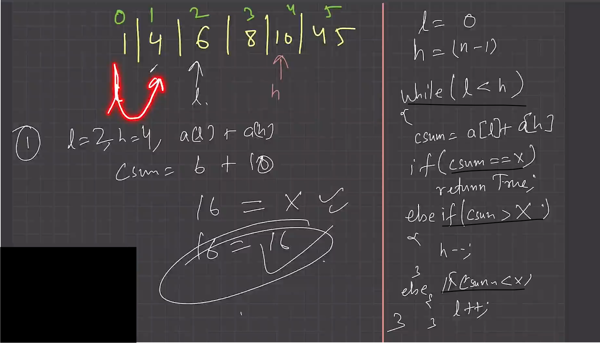

# Array Problems

### 1. Two Sum : Check if a pair with given sum exists in Array.
Given an array of integers nums and an integer target, return indices of the two numbers such that they add up to target.   
[:link: LeetCode ](#https://leetcode.com/problems/two-sum/description/),    
[:link: TakeUForward Solution Article](#https://takeuforward.org/data-structure/two-sum-check-if-a-pair-with-given-sum-exists-in-array/) - Bruteforse, Beter and Best apraoch discussed.


#
```C++
string twoSum(int n, vector<int> &arr, int target) {
    sort(arr.begin(), arr.end());
    int left = 0, right = n - 1;
    while (left < right) {
        int sum = arr[left] + arr[right];
        if (sum == target) {
            return "YES";
        }
        else if (sum < target) left++;
        else right--;
    }
    return "NO";
}
```