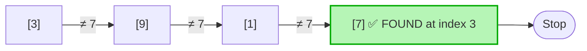
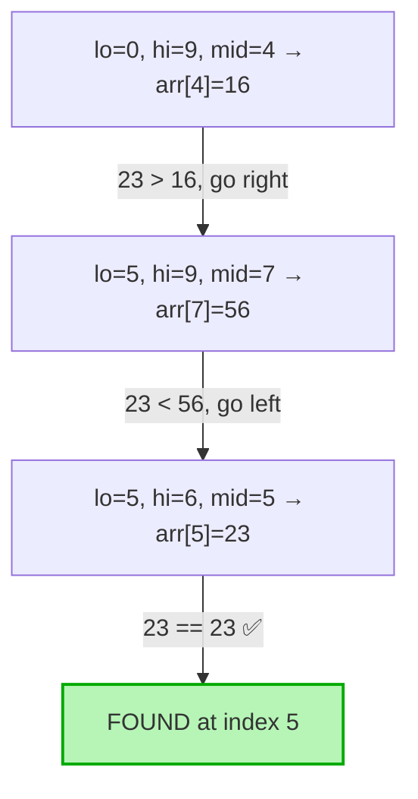

# Searching Algorithms

> Notes on classical searching algorithms with theory, diagrams, C++ implementations, complexity analysis, and trade-offs.

## Table of Contents
1. [Linear Search](#1-linear-search)
2. [Binary Search](#2-binary-search)

---

## 1. Linear Search

### Theory

**Linear Search** (a.k.a. **Sequential Search**) walks through the collection one element at a time, comparing each element with the target key until it finds a match or exhausts the collection.

- Works on **any** data structure that supports sequential traversal (arrays, linked lists, vectors, files…).
- **Does NOT require the data to be sorted.**
- The simplest possible search — no preprocessing, no extra memory.

### Visual Representation

Searching for `7` in `[3, 9, 1, 7, 5, 2]`:



Step-by-step comparison:

```
Index:    0    1    2    3    4    5
Array:  [ 3 ][ 9 ][ 1 ][ 7 ][ 5 ][ 2 ]
          ↑                                  step 1: 3 ≠ 7
               ↑                             step 2: 9 ≠ 7
                    ↑                        step 3: 1 ≠ 7
                         ↑   ← FOUND!        step 4: 7 == 7  → return index 3
```

### Code (C++)

```cpp
#include <vector>

// Returns the index of target if found, otherwise -1.
int linearSearch(const std::vector<int>& arr, int target) {
    for (int i = 0; i < (int)arr.size(); ++i) {
        if (arr[i] == target) {
            return i;          // Found
        }
    }
    return -1;                 // Not found
}
```

**STL one-liner equivalent:**

```cpp
#include <algorithm>
auto it = std::find(arr.begin(), arr.end(), target);
int index = (it != arr.end()) ? (int)(it - arr.begin()) : -1;
```

**Sentinel Linear Search** (small optimization — removes the bound-check inside the loop):

```cpp
int sentinelLinearSearch(std::vector<int>& arr, int target) {
    int n = arr.size();
    int last = arr[n - 1];
    arr[n - 1] = target;                // place sentinel

    int i = 0;
    while (arr[i] != target) ++i;

    arr[n - 1] = last;                  // restore
    if (i < n - 1 || arr[n - 1] == target)
        return i;
    return -1;
}
```

### Time & Space Complexity

| Case | Comparisons | Complexity |
|---|---|---|
| **Best case** | 1 (target at index 0) | O(1) |
| **Average case** | n/2 | O(n) |
| **Worst case** | n (target absent or at end) | O(n) |
| **Space** | No extra memory | O(1) |

### When to Use

✅ Use Linear Search when:
- Data is **unsorted** and sorting cost is not justified.
- The collection is **small** (n ≤ ~100; cache-friendly, often beats binary search in practice).
- Data structure **does not support random access** (e.g., singly linked list, stream).
- You need a **one-off search** — no preprocessing budget.
- Searching for the **first match** in unsorted data.
- Search key may appear **multiple times** and you want all occurrences (linear scan is natural).

### Advantages

- **Simple** — easy to implement and debug.
- **No preprocessing** — works directly on raw data.
- **No constraints** on data ordering or structure.
- **In-place** — O(1) extra memory.
- **Works on any iterable**, including streams.
- Easy to **early-exit** on first match.

### Limitations

- **Slow** for large collections — O(n) per search.
- Not viable when you need many lookups on the same dataset (cumulative cost dominates).
- Cannot exploit ordering even if data happens to be sorted.

---

## 2. Binary Search

### Theory

**Binary Search** repeatedly halves a **sorted** search range, comparing the middle element with the target and discarding the half that cannot contain it.

- **Requires sorted data** (ascending or descending — consistent order).
- Requires **random access** in O(1) (arrays, vectors, `std::deque`) for true O(log n).
- Each iteration eliminates **half** of the remaining candidates → logarithmic complexity.

### Visual Representation

Searching for `23` in sorted `[2, 5, 8, 12, 16, 23, 38, 56, 72, 91]` (10 elements):



Step-by-step window contraction:

```
Index:     0   1   2   3   4   5   6   7   8   9
Array:   [ 2][ 5][ 8][12][16][23][38][56][72][91]

Step 1:   lo──────────────mid──────────────hi      arr[4]=16 < 23  → lo = mid+1
                              ✗ discard left half

Step 2:                   lo──────mid──────hi      arr[7]=56 > 23  → hi = mid-1
                                            ✗ discard right half

Step 3:                   lo─mid─hi                arr[5]=23 == 23 → ✅ index 5
```

### Code (C++)

**Iterative (recommended — avoids recursion overhead):**

```cpp
#include <vector>

// Returns index of target in sorted ascending array, or -1 if absent.
int binarySearch(const std::vector<int>& arr, int target) {
    int lo = 0;
    int hi = (int)arr.size() - 1;

    while (lo <= hi) {
        int mid = lo + (hi - lo) / 2;   // avoids (lo+hi) overflow

        if (arr[mid] == target)
            return mid;
        else if (arr[mid] < target)
            lo = mid + 1;
        else
            hi = mid - 1;
    }
    return -1;
}
```

**Recursive:**

```cpp
int binarySearchRec(const std::vector<int>& arr, int lo, int hi, int target) {
    if (lo > hi) return -1;

    int mid = lo + (hi - lo) / 2;
    if (arr[mid] == target)      return mid;
    if (arr[mid] < target)       return binarySearchRec(arr, mid + 1, hi, target);
    /* arr[mid] > target */       return binarySearchRec(arr, lo, mid - 1, target);
}
```

**STL equivalents:**

```cpp
#include <algorithm>

bool found        = std::binary_search(arr.begin(), arr.end(), target);
auto lb           = std::lower_bound(arr.begin(), arr.end(), target);   // first >= target
auto ub           = std::upper_bound(arr.begin(), arr.end(), target);   // first  >  target
auto [first,last] = std::equal_range(arr.begin(), arr.end(), target);   // range of matches
```

### Time & Space Complexity

| Case | Comparisons | Complexity |
|---|---|---|
| **Best case** | 1 (target at middle) | O(1) |
| **Average case** | log₂ n | O(log n) |
| **Worst case** | ⌊log₂ n⌋ + 1 | O(log n) |
| **Space (iterative)** | – | O(1) |
| **Space (recursive)** | call stack | O(log n) |

> Searching 1,000,000 elements: linear → up to 1,000,000 comparisons. Binary → at most ~20 comparisons.

### When to Use

✅ Use Binary Search when:
- Data is **already sorted** (or sorting cost is amortized over many lookups).
- Data structure supports **O(1) random access** (array, `vector`, `deque`).
- You need **fast repeated lookups** in a static or rarely-changing dataset.
- Implementing **lower_bound / upper_bound** style queries (insertion position, range count).
- Searching in problems with a **monotonic predicate** (binary search on the answer).

❌ Avoid binary search when:
- Data is **unsorted** and you can't afford sorting.
- Container is a **linked list** (no random access → degrades to O(n log n)).
- Data changes frequently (re-sort cost wipes out the gain — use a tree/hash instead).

### Advantages

- **Very fast** — O(log n); 30 comparisons cover ~10⁹ elements.
- **Predictable, bounded** worst-case time.
- **In-place** — no extra memory (iterative version).
- Foundation for **lower_bound/upper_bound**, range queries, and "binary search on answer" patterns.
- Cache-friendly when working on contiguous arrays.

### Limitations

- **Requires sorted data** — sorting itself costs O(n log n).
- **Random access required** — slow on linked lists.
- **Insertions/deletions** disrupt order → costly to maintain sorted invariant.
- Slightly **tricky to implement correctly** (off-by-one, overflow with `(lo+hi)/2`, infinite loops).
- For **very small n** (~< 32), linear search may actually win due to branch prediction & cache effects.

---

## Linear vs Binary — Quick Comparison

| Aspect | Linear Search | Binary Search |
|---|---|---|
| **Time complexity** | O(n) | O(log n) |
| **Space complexity** | O(1) | O(1) iterative, O(log n) recursive |
| **Data must be sorted?** | ❌ No | ✅ Yes |
| **Random access needed?** | ❌ No | ✅ Yes |
| **Works on linked list?** | ✅ Yes (O(n)) | ⚠️ Yes but O(n) — defeats purpose |
| **Implementation difficulty** | Trivial | Moderate (edge cases) |
| **Best for** | Small / unsorted / one-off | Large / sorted / repeated lookups |
| **Preprocessing cost** | None | O(n log n) sort (if not already sorted) |
| **Comparisons for n=1,000,000** | up to 1,000,000 | up to ~20 |

### Rule of thumb

- **n small, or unsorted, or one search** → Linear Search.
- **n large, sorted, many searches** → Binary Search.
- **Frequent inserts + searches** → use `std::set` / `std::unordered_set` instead.
