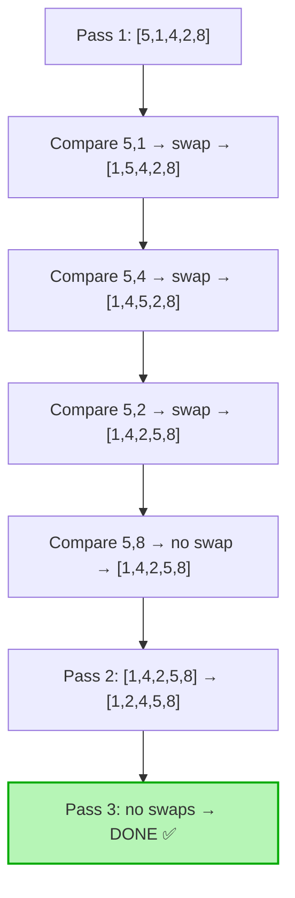
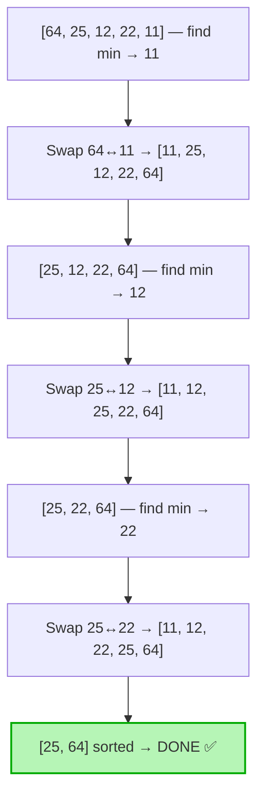
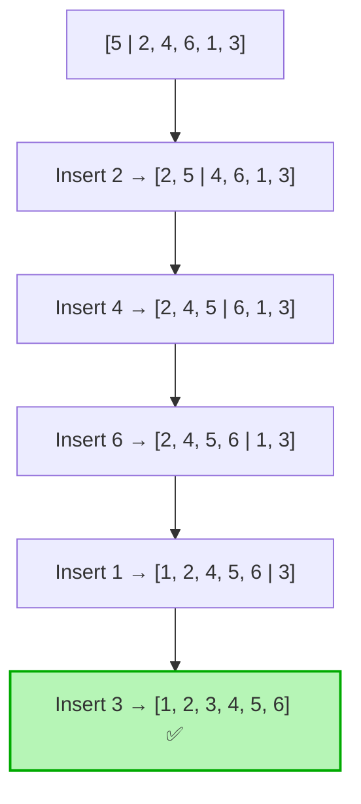
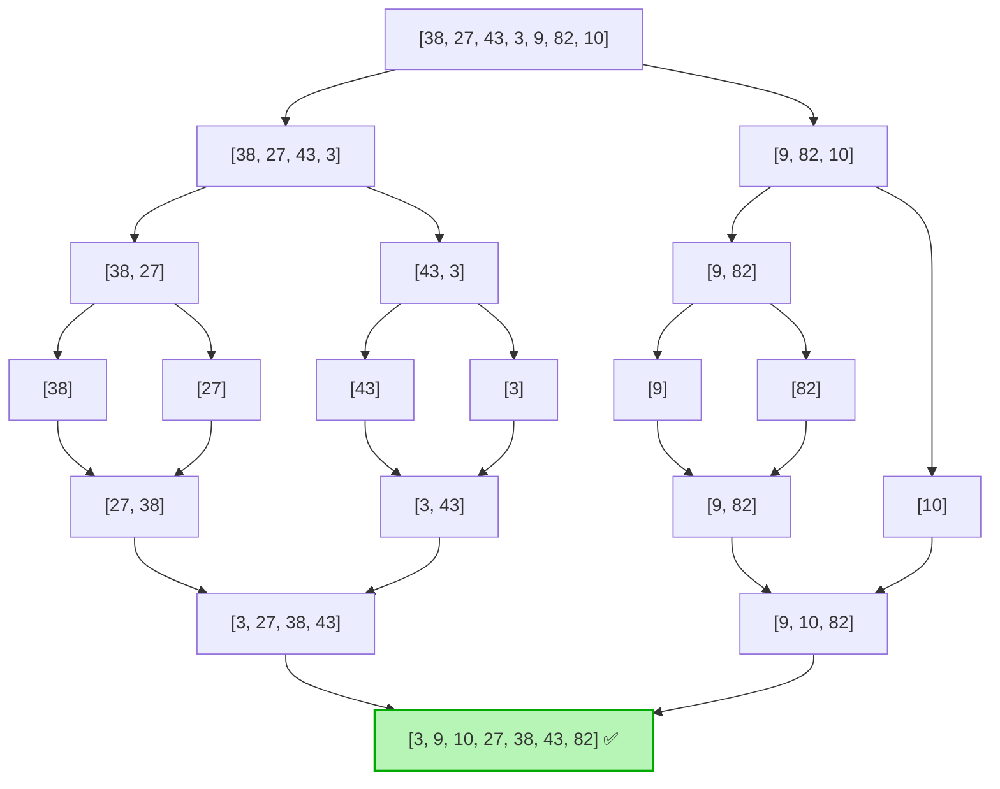
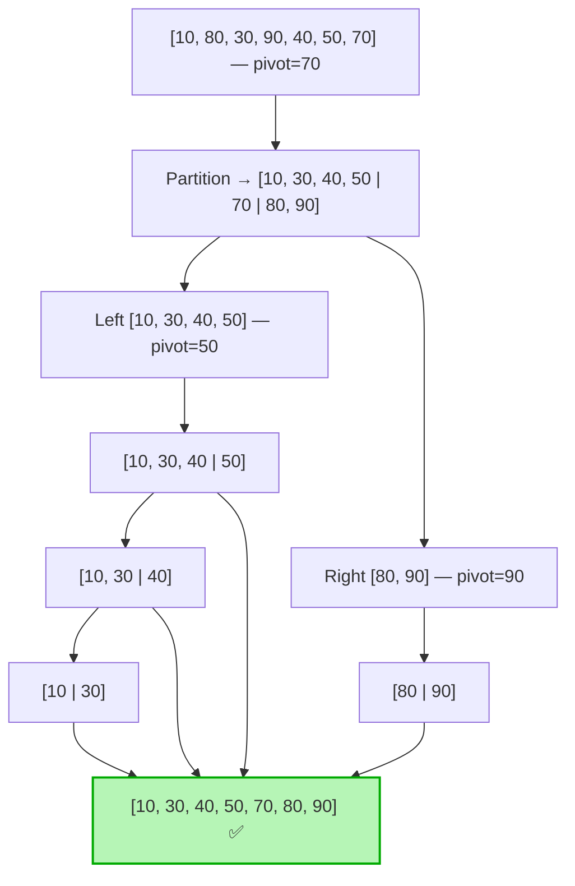

# Sorting Algorithms

> Notes on classical sorting algorithms — theory, diagrams, C++ implementations, complexity, and trade-offs.

## Table of Contents
1. [Bubble Sort](#1-bubble-sort)
2. [Selection Sort](#2-selection-sort)
3. [Insertion Sort](#3-insertion-sort)
4. [Merge Sort](#4-merge-sort)
5. [Quick Sort](#5-quick-sort)
6. [Comparison Summary](#comparison-summary)

---

## 1. Bubble Sort

### Theory

**Bubble Sort** repeatedly walks through the array, comparing **adjacent pairs** and swapping them if they are out of order. After each full pass, the **largest remaining element "bubbles up"** to its final position at the end. The process repeats until no swaps are needed.

- **Comparison-based**, **in-place**, **stable**.
- Best for teaching; rarely used in practice due to O(n²) cost.
- Optimization: a `swapped` flag lets us exit early when the array becomes sorted before all passes complete.

### Visual Representation

Sorting `[5, 1, 4, 2, 8]`:



ASCII trace (one pass):

```
Start:  [ 5  1  4  2  8 ]
         ↑↑                 5 > 1 → swap
        [ 1  5  4  2  8 ]
            ↑↑              5 > 4 → swap
        [ 1  4  5  2  8 ]
               ↑↑           5 > 2 → swap
        [ 1  4  2  5  8 ]
                  ↑↑        5 < 8 → no swap
        [ 1  4  2  5  8 ]   ← largest (8) is now in place
```

### Code (C++)

```cpp
#include <vector>
#include <utility>

void bubbleSort(std::vector<int>& arr) {
    int n = arr.size();
    for (int i = 0; i < n - 1; ++i) {
        bool swapped = false;
        for (int j = 0; j < n - i - 1; ++j) {
            if (arr[j] > arr[j + 1]) {
                std::swap(arr[j], arr[j + 1]);
                swapped = true;
            }
        }
        if (!swapped) break;        // early exit — already sorted
    }
}
```

### Time & Space Complexity

| Case | Time | Notes |
|---|---|---|
| **Best** (already sorted) | O(n) | thanks to `swapped` flag |
| **Average** | O(n²) | |
| **Worst** (reverse sorted) | O(n²) | |
| **Space** | O(1) | in-place |
| **Stable** | ✅ Yes | equal elements never swap |

### When to Use

- **Educational** demonstrations of swapping & passes.
- **Tiny arrays** (n ≤ ~10) where simplicity matters more than speed.
- When the array is **nearly sorted** — early-exit makes it O(n).

### Advantages

- Extremely **simple** to understand and implement.
- **Stable** sort.
- **In-place** (O(1) extra memory).
- **Adaptive** with the `swapped` optimization.
- Detects already-sorted input in a single pass.

### Limitations

- **O(n²)** — unusable for large datasets.
- Performs many **redundant swaps** even when better algorithms exist.
- Almost never the right choice in production code.

---

## 2. Selection Sort

### Theory

**Selection Sort** divides the array into a sorted prefix (initially empty) and an unsorted suffix. On each pass, it **finds the minimum element in the unsorted part** and swaps it with the first unsorted position.

- Performs **exactly n−1 swaps** — minimum among comparison sorts.
- **Not stable** by default (the long-distance swap can reorder equal elements).
- **In-place**, **comparison-based**.

### Visual Representation

Sorting `[64, 25, 12, 22, 11]`:



ASCII trace:

```
Pass 1: scan [64 25 12 22 11] → min=11 at idx 4 → swap with idx 0
        [11 | 25 12 22 64]
Pass 2: scan [25 12 22 64]   → min=12 at idx 2 → swap with idx 1
        [11 12 | 25 22 64]
Pass 3: scan [25 22 64]      → min=22 at idx 3 → swap with idx 2
        [11 12 22 | 25 64]
Pass 4: scan [25 64]         → min=25 already in place
        [11 12 22 25 | 64]   ✅
```

### Code (C++)

```cpp
#include <vector>
#include <utility>

void selectionSort(std::vector<int>& arr) {
    int n = arr.size();
    for (int i = 0; i < n - 1; ++i) {
        int minIdx = i;
        for (int j = i + 1; j < n; ++j) {
            if (arr[j] < arr[minIdx]) {
                minIdx = j;
            }
        }
        if (minIdx != i) {
            std::swap(arr[i], arr[minIdx]);
        }
    }
}
```

### Time & Space Complexity

| Case | Time | Notes |
|---|---|---|
| **Best** | O(n²) | always scans entire unsorted region |
| **Average** | O(n²) | |
| **Worst** | O(n²) | |
| **Swaps** | O(n) | at most n−1 |
| **Space** | O(1) | in-place |
| **Stable** | ❌ No | the swap can leapfrog equal elements |

### When to Use

- When **writes are expensive** (e.g., flash memory) — minimum number of swaps.
- For **small arrays** where simplicity matters.
- When you specifically need the **k-th smallest** elements (related to partial selection).

### Advantages

- Performs **the fewest writes** of any O(n²) sort (only n−1 swaps).
- **In-place**, no extra memory.
- Simple to implement.
- Predictable performance — always exactly O(n²) comparisons.

### Limitations

- **O(n²)** even on already-sorted data — not adaptive.
- **Not stable**.
- Outperformed by insertion sort on nearly all inputs.

---

## 3. Insertion Sort

### Theory

**Insertion Sort** builds the sorted array **one element at a time**. For each new element, it shifts the larger elements of the sorted prefix one position to the right and **inserts the new element at its correct position** — just like sorting playing cards in your hand.

- **Stable**, **in-place**, **adaptive**.
- **Excellent on small or nearly-sorted data** — often used as a final pass in hybrid sorts (Timsort, Introsort).

### Visual Representation

Sorting `[5, 2, 4, 6, 1, 3]`:



ASCII trace (inserting `1` into sorted prefix `[2 4 5 6]`):

```
Sorted | Unsorted
[2 4 5 6] | 1 3       key = 1
[2 4 5 _6] ← 6 shifts right
[2 4 _5 6]
[2 _4 5 6]
[_2 4 5 6]
[1 2 4 5 6] | 3       ← key inserted at index 0
```

### Code (C++)

```cpp
#include <vector>

void insertionSort(std::vector<int>& arr) {
    int n = arr.size();
    for (int i = 1; i < n; ++i) {
        int key = arr[i];
        int j = i - 1;
        while (j >= 0 && arr[j] > key) {
            arr[j + 1] = arr[j];        // shift right
            --j;
        }
        arr[j + 1] = key;               // place key
    }
}
```

### Time & Space Complexity

| Case | Time | Notes |
|---|---|---|
| **Best** (already sorted) | O(n) | inner loop exits immediately |
| **Average** | O(n²) | |
| **Worst** (reverse sorted) | O(n²) | |
| **Space** | O(1) | in-place |
| **Stable** | ✅ Yes | only shifts strictly greater elements |
| **Adaptive** | ✅ Yes | nearly-sorted → ~O(n) |

### When to Use

- **Small arrays** (n ≤ ~32) — used as the base case in `std::sort` / Timsort.
- **Nearly-sorted** data — runs in close to O(n).
- **Online algorithms** — can sort as elements arrive one by one.
- When data is gradually appended and you want to keep it sorted incrementally.

### Advantages

- **Adaptive** — O(n) on nearly-sorted input.
- **Stable**, **in-place**.
- Very **low constant factor** — fastest for tiny arrays.
- **Online** — process one element at a time.
- Simple, intuitive logic.

### Limitations

- **O(n²)** worst case — unsuitable for large random data.
- Many element shifts when inserting near the front of a long sorted prefix.

---

## 4. Merge Sort

### Theory

**Merge Sort** is a classic **divide-and-conquer** algorithm:

1. **Divide** the array into two halves.
2. **Recursively sort** each half.
3. **Merge** the two sorted halves into a single sorted array.

- **Guaranteed O(n log n)** in all cases.
- **Stable**.
- **Not in-place** — needs O(n) auxiliary memory for the merge step.
- The default choice when **stability + guaranteed worst-case** are required.

### Visual Representation

Sorting `[38, 27, 43, 3, 9, 82, 10]`:



ASCII view:

```
            [38, 27, 43, 3, 9, 82, 10]
                       │ split
        ┌──────────────┴──────────────┐
   [38, 27, 43, 3]               [9, 82, 10]
        │ split                       │ split
   ┌────┴────┐                  ┌─────┴─────┐
[38,27]   [43,3]             [9,82]      [10]
   │         │                  │           │
 [27,38]  [3,43]             [9,82]      [10]
   └────┬────┘                  └─────┬─────┘
   [3, 27, 38, 43]               [9, 10, 82]
              └────────┬──────────┘ merge
         [3, 9, 10, 27, 38, 43, 82] ✅
```

### Code (C++)

```cpp
#include <vector>

void merge(std::vector<int>& arr, int lo, int mid, int hi) {
    std::vector<int> left (arr.begin() + lo,    arr.begin() + mid + 1);
    std::vector<int> right(arr.begin() + mid+1, arr.begin() + hi  + 1);

    int i = 0, j = 0, k = lo;
    while (i < (int)left.size() && j < (int)right.size()) {
        if (left[i] <= right[j])            // '<=' keeps the sort stable
            arr[k++] = left[i++];
        else
            arr[k++] = right[j++];
    }
    while (i < (int)left.size())  arr[k++] = left[i++];
    while (j < (int)right.size()) arr[k++] = right[j++];
}

void mergeSort(std::vector<int>& arr, int lo, int hi) {
    if (lo >= hi) return;
    int mid = lo + (hi - lo) / 2;
    mergeSort(arr, lo, mid);
    mergeSort(arr, mid + 1, hi);
    merge(arr, lo, mid, hi);
}

// Wrapper
void mergeSort(std::vector<int>& arr) {
    if (!arr.empty()) mergeSort(arr, 0, (int)arr.size() - 1);
}
```

### Time & Space Complexity

| Case | Time | Notes |
|---|---|---|
| **Best** | O(n log n) | |
| **Average** | O(n log n) | |
| **Worst** | O(n log n) | guaranteed |
| **Space** | O(n) | auxiliary buffer for merging |
| **Stable** | ✅ Yes | when using `<=` in the merge |

### When to Use

- When **worst-case guarantees** matter (real-time, financial systems).
- When **stability** is required.
- **Sorting linked lists** — merge sort needs only sequential access (O(1) extra space on lists).
- **External sorting** (data larger than memory) — sort chunks, merge from disk.
- **Parallel sorting** — the two halves can be sorted independently in parallel.

### Advantages

- **Guaranteed O(n log n)** — no quadratic worst case.
- **Stable**.
- Excellent for **linked lists** (no random access needed).
- Naturally **parallelizable** and **external-storage friendly**.
- Predictable performance regardless of input distribution.

### Limitations

- **O(n) extra memory** — disqualifying for memory-constrained environments.
- Higher constant factor than quicksort on random in-memory arrays.
- Recursion overhead (can be mitigated with iterative bottom-up version).
- Not cache-friendly compared to in-place algorithms.

---

## 5. Quick Sort

### Theory

**Quick Sort** is another **divide-and-conquer** algorithm, but it does its work **before** recursing (the opposite of merge sort):

1. **Pick a pivot** element.
2. **Partition** the array so all elements `< pivot` go left and all `> pivot` go right.
3. **Recursively sort** the two partitions.

- **In-place** (O(log n) stack only), **not stable**.
- **Average O(n log n)** with very low constant factor — usually the **fastest** comparison sort on random in-memory data.
- **Worst case O(n²)** on bad pivot choices (e.g., already-sorted with last-element pivot). Mitigated by **randomized pivot** or **median-of-three**.
- Backbone of `std::sort` (typically Introsort = Quick + Heap + Insertion).

### Visual Representation

Sorting `[10, 80, 30, 90, 40, 50, 70]` with last-element pivot:



ASCII partition step (Lomuto scheme, pivot = 70):

```
[10  80  30  90  40  50  70]   pivot = 70 (last)
 ↑i                       ↑pivot

scan from left, swap elements ≤ 70 to the front:
 10 ≤ 70 → keep:  [10 | 80  30  90  40  50  70]
 80 > 70 → skip
 30 ≤ 70 → swap 80,30 → [10  30 | 80  90  40  50  70]
 90 > 70 → skip
 40 ≤ 70 → swap 80,40 → [10  30  40 | 90  80  50  70]
 50 ≤ 70 → swap 90,50 → [10  30  40  50 | 80  90  70]

Finally swap pivot into place:
 [10  30  40  50 | 70 | 90  80]   ← pivot in final position
```

### Code (C++)

**Lomuto partition (simple, common in textbooks):**

```cpp
#include <vector>
#include <utility>
#include <cstdlib>

int partition(std::vector<int>& arr, int lo, int hi) {
    int pivot = arr[hi];
    int i = lo - 1;
    for (int j = lo; j < hi; ++j) {
        if (arr[j] <= pivot) {
            ++i;
            std::swap(arr[i], arr[j]);
        }
    }
    std::swap(arr[i + 1], arr[hi]);
    return i + 1;                       // pivot's final index
}

void quickSort(std::vector<int>& arr, int lo, int hi) {
    if (lo >= hi) return;
    // Randomized pivot to avoid O(n^2) on sorted input
    int randIdx = lo + std::rand() % (hi - lo + 1);
    std::swap(arr[randIdx], arr[hi]);

    int p = partition(arr, lo, hi);
    quickSort(arr, lo, p - 1);
    quickSort(arr, p + 1, hi);
}

// Wrapper
void quickSort(std::vector<int>& arr) {
    if (!arr.empty()) quickSort(arr, 0, (int)arr.size() - 1);
}
```

**Hoare partition (fewer swaps, faster in practice):**

```cpp
int hoarePartition(std::vector<int>& arr, int lo, int hi) {
    int pivot = arr[lo + (hi - lo) / 2];
    int i = lo - 1, j = hi + 1;
    while (true) {
        do { ++i; } while (arr[i] < pivot);
        do { --j; } while (arr[j] > pivot);
        if (i >= j) return j;
        std::swap(arr[i], arr[j]);
    }
}
```

### Time & Space Complexity

| Case | Time | Notes |
|---|---|---|
| **Best** | O(n log n) | pivot splits evenly |
| **Average** | O(n log n) | with random pivot |
| **Worst** | O(n²) | bad pivot (sorted input + naive pivot) |
| **Space** | O(log n) | recursion stack |
| **Stable** | ❌ No | partition swaps reorder equals |

### When to Use

- **General-purpose in-memory sorting** of arrays (default choice in most languages).
- When **average-case speed** matters more than worst-case guarantee.
- When **memory is constrained** (in-place).
- Inside hybrid sorts like **Introsort** (used by `std::sort`).

### Advantages

- **Fastest in practice** for random in-memory arrays (small constant factor).
- **In-place** (O(log n) stack only).
- **Cache-friendly** — sequential access patterns.
- Tunable: median-of-three, randomized pivot, 3-way partition (Dutch national flag), tail-call optimization.

### Limitations

- **Worst case O(n²)** — must use randomization or median-of-three to avoid.
- **Not stable**.
- **Recursive** — deep recursion can stack-overflow without tail-call elimination on adversarial inputs.
- Performance heavily depends on pivot quality.

---

## Comparison Summary

| Algorithm | Best | Average | Worst | Space | Stable | In-place | Adaptive | Typical use |
|---|---|---|---|---|---|---|---|---|
| **Bubble**    | O(n)       | O(n²)      | O(n²)      | O(1)     | ✅ | ✅ | ✅ | Teaching, tiny arrays |
| **Selection** | O(n²)      | O(n²)      | O(n²)      | O(1)     | ❌ | ✅ | ❌ | Minimize writes |
| **Insertion** | O(n)       | O(n²)      | O(n²)      | O(1)     | ✅ | ✅ | ✅ | Small / nearly-sorted, base case of hybrids |
| **Merge**     | O(n log n) | O(n log n) | O(n log n) | O(n)     | ✅ | ❌ | ❌ | Stable + worst-case guarantee, linked lists, external sort |
| **Quick**     | O(n log n) | O(n log n) | O(n²)      | O(log n) | ❌ | ✅ | ❌ | General-purpose in-memory, `std::sort` backbone |

### Quick decision guide

- **n ≤ 16** → Insertion Sort.
- **Need stable + guaranteed O(n log n)** → Merge Sort.
- **Random data, performance critical, memory tight** → Quick Sort (randomized).
- **Sorting a linked list** → Merge Sort.
- **Sorting data larger than RAM** → External Merge Sort.
- **General application code** → just use `std::sort` (Introsort) or `std::stable_sort` (Timsort-like).
